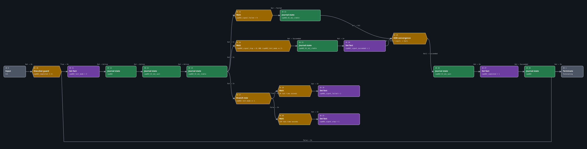

# Lab 2: Signal Race

Lab 2 turns a single linear quest into two independently observable routes. It
uses an immediate selector, two fact-listening Pause Conditions, two realtime
Pause Conditions, a nested Boolean AND, and an XOR-typed convergence without
relying on an untested cancellation claim.

| Record | Value |
| --- | --- |
| Procedure review date | 2026-08-09 |
| Structural validation date | 2026-08-09 |
| Runtime test date | Not yet recorded |

**Lab 2 runtime evidence:** **Experimental** — pending.

**Implementation status:** both supplied checkpoints are **Structurally
validated** after all six mod-owned CR2W resources were cooked and serialized
back with WolvenKit 8.19.0. Runtime timing, active-listener persistence, XOR
emission, re-entry, and reload behavior remain governed by the pending
acceptance record.

Follow [Author Signal Race in WolvenKit](lab-02-authoring.md) to build the graph
from the start checkpoint. Use [Test both Signal Race routes](lab-02-test.md)
to keep the canonical and source-edited candidates, saves, and logs separate.

## What the lab demonstrates

The canonical project sets `cqa002_test_mode` to `2` and takes the stable route:

```text
entry -> completed guard -> test_mode = 2 -> activate quest/objectives
  -> immediate selector chooses False
  -> wait 120 realtime seconds -> signal_stop = 1
  -> waiting AND observes signal_stop > 0 AND test_mode == 2
  -> optional objective succeeds -> XOR-shaped convergence
  -> required objective succeeds -> completed = 1 -> quest succeeds
```

A controlled source edit changes only node `11` from exact value `2` to `1`:

```text
entry -> completed guard -> test_mode = 1 -> activate quest/objectives
  -> immediate selector chooses True
  -> wait 30 realtime seconds -> signal_failed = 1
  -> failure listener continues
  -> optional objective fails -> XOR-shaped convergence
  -> required objective succeeds -> completed = 1 -> quest succeeds
```

Only the selected writer delay starts in either candidate. The other monitor is
still a lifecycle obligation, but its reserved fact has no writer in that
variant. The lab therefore does not need to claim that XOR cancels a losing
timer. Phase-exit cleanup and arbitrary external fact writes remain
**Experimental**.

## Prerequisites and downloads

Complete [Lab 1](../start-here/lab-01.md) and read:

- [Immediate and waiting conditions](immediate-and-waiting.md);
- [Boolean condition trees](boolean-trees.md);
- [Signal-flow nodes](signal-flow.md);
- [Parallel monitors and cancellation](monitors-and-cancellation.md).

Use Cyberpunk 2077 `2.31a`, WolvenKit `8.19.0`, ArchiveXL `1.27.0`, RED4ext
`1.30.0`, and redscript `0.5.31`.

- [Download the start checkpoint](../downloads/cqa-lab-02-start.zip). It has
  the journal, localization, registration, and a two-node terminating phase.
- [Download the completed checkpoint](../downloads/cqa-lab-02-completed.zip).
  It has the exact 21-node graph and its review sources.

Do not install the two checkpoints together. They register the same depot
paths. Use separate untouched pre-Lab-2 saves for the mode-2 and mode-1 runtime
variants; all five tutorial facts and the journal lifecycle are save-backed.

## Resource model

| Resource | Depot path | Owns |
| --- | --- | --- |
| Root questphase | `mod\cqa\cqa002\phases\cqa002.questphase` | Guard, selector, monitors, delays, fact writes, journal operations, convergence, termination |
| Journal | `mod\cqa\cqa002\journal\cqa002.journal` | Quest, phase, required objective, optional objective |
| Onscreen localization | `mod\cqa\cqa002\localization\en-us\onscreens\cqa002.json` | Three English strings used by the journal |
| ArchiveXL registration | `CQA_Lab02_SignalRace.archive.xl` | Root attachment plus journal/localization merges |

The start checkpoint supplies the same journal and localization content as the
completed checkpoint. Its questphase has only Input `0`, terminating Output
`1`, and one ordinary edge. This makes it an executable authoring baseline,
not an empty folder or a hidden generator input.

## Journal and localization contract

```text
quests
└── minor_quest
    └── cqa002                              gameJournalQuest
        └── cqa002_01                       gameJournalQuestPhase
            ├── cqa002_01_obj_wait          required objective
            └── cqa002_01_obj_stable        optional objective
```

| Journal entry | Key | English text |
| --- | --- | --- |
| `cqa002` title | `cqa_cqa002_title` | `Signal Race` |
| `cqa002_01_obj_wait` description | `cqa_cqa002_objective_wait` | `Wait for the signal test to resolve.` |
| `cqa002_01_obj_stable` description | `cqa_cqa002_objective_stable` | `Keep the signal stable.` |

The stable journal objective has `optional: 1`. The corresponding questphase
journal-node payloads retain their normal `type.optional: 0`; do not copy the
journal entry's optional flag into that unrelated node field. Every typed path
uses `fileEntryIndex: 2` because `cqa002` is the containing
`gameJournalQuest` at path component two.

## Exact questphase



The figure is generated from the completed checkpoint's CR2W-JSON. Repository
validation resolves every socket handle, requires exactly 21 nodes and 22
edges, and rejects a stale source fingerprint or SVG.

| ID | RED node type | Decisive payload | Purpose |
| ---: | --- | --- | --- |
| `0` | `questInputNodeDefinition` | interface `In1` | Enter from the registered root |
| `1` | `questOutputNodeDefinition` | `Terminating`, interface `Out1` | End completed and bypass routes |
| `10` | `questConditionNodeDefinition` | `cqa002_completed Equal 0` | Branch immediately around a completed save |
| `11` | `questFactsDBManagerNodeDefinition` | set `cqa002_test_mode` exactly `2` | Select the canonical variant; edit only this value for failure testing |
| `12` | `questJournalNodeDefinition` | quest path | Activate and track Signal Race |
| `13` | `questJournalNodeDefinition` | required-objective path | Activate the required objective |
| `14` | `questJournalNodeDefinition` | optional-objective path | Activate the optional objective and fan out its `Out` |
| `15` | `questPauseConditionNodeDefinition` | `cqa002_signal_failed Greater 0` | Wait for the failure result |
| `16` | `questPauseConditionNodeDefinition` | AND of stop fact and mode `2` | Wait for the canonical stable result |
| `17` | `questConditionNodeDefinition` | `cqa002_test_mode Equal 1` | Choose one writer branch immediately |
| `18` | `questPauseConditionNodeDefinition` | 30-second realtime delay | Delay the edited failure writer |
| `19` | `questFactsDBManagerNodeDefinition` | set `cqa002_signal_failed` exactly `1` | Fulfil the failure listener |
| `20` | `questPauseConditionNodeDefinition` | 120-second realtime delay | Delay the canonical stable writer and leave time for a mid-flow save |
| `21` | `questFactsDBManagerNodeDefinition` | set `cqa002_signal_stop` exactly `1` | Fulfil the stable AND listener |
| `22` | `questJournalNodeDefinition` | optional objective, `Failed` input | Record optional failure |
| `23` | `questJournalNodeDefinition` | optional objective, `Succeeded` input | Record optional success |
| `24` | `questFactsDBManagerNodeDefinition` | set `cqa002_signal_succeeded` exactly `1` | Persist the stable-route outcome |
| `25` | `questLogicalXorNodeDefinition` | two inputs, one output | Converge the mutually exclusive outcome routes |
| `26` | `questJournalNodeDefinition` | required objective, `Succeeded` input | Complete the required objective |
| `27` | `questFactsDBManagerNodeDefinition` | set `cqa002_completed` exactly `1` | Persist the one-shot completion guard |
| `28` | `questJournalNodeDefinition` | quest path, `Succeeded` input | Complete Signal Race |

Every supplied node has one job; no node is a magic template. In particular,
ID `16` owns a Boolean condition tree, while ID `25` combines graph signals.
They use similar logical vocabulary at different resource layers.

## Exact edge contract

| Source | Destination | Meaning |
| --- | --- | --- |
| `0.Out` | `10.In` | Enter guard |
| `10.False` | `1.In` | Completed save bypass |
| `10.True` | `11.In` | First-run variant setup |
| `11.Out` | `12.Active` | Activate quest |
| `12.Out` | `13.Active` | Activate required objective |
| `13.Out` | `14.Active` | Activate optional objective |
| `14.Out` | `15.In` | Arm failure listener |
| `14.Out` | `16.In` | Arm stable listener |
| `14.Out` | `17.In` | Evaluate selector now |
| `17.True` | `18.In` | Edited mode: start failure delay |
| `18.Out` | `19.In` | Write failure fact |
| `17.False` | `20.In` | Canonical mode: start stable delay |
| `20.Out` | `21.In` | Write stop fact |
| `15.Out` | `22.Failed` | Fail optional objective |
| `22.Out` | `25.In1` | Failure outcome reaches convergence |
| `16.Out` | `23.Succeeded` | Succeed optional objective |
| `23.Out` | `24.In` | Record stable success |
| `24.Out` | `25.In2` | Stable outcome reaches convergence |
| `25.Out1` | `26.Succeeded` | Complete required objective |
| `26.Out` | `27.In` | Write completion fact |
| `27.Out` | `28.Succeeded` | Complete quest |
| `28.Out` | `1.In` | Terminate successful route |

The three edges from `14.Out` are three connections on one ordinary socket.
There is no Hub. The two edges into Output `1.In` also share one destination
socket; socket count is not connection count.

## Fact ownership

| Fact | Writer | Reader | Purpose |
| --- | --- | --- | --- |
| `cqa002_test_mode` | `11` | `16`, `17` | Select and constrain the test variant |
| `cqa002_signal_failed` | `19` | `15` | Failure monitor result |
| `cqa002_signal_stop` | `21` | `16` | Stable monitor stop signal |
| `cqa002_signal_succeeded` | `24` | retained evidence/extension point | Record stable optional success |
| `cqa002_completed` | `27` | `10` | Bypass completed saves |

These names are reserved to Lab 2. Do not use console writes or another mod to
drive them during canonical acceptance; doing so changes which producer owns
the result.

## Evidence still required

Structural checks do not answer whether an active Pause Condition survives a
reload, whether the XOR output can emit again, or whether terminating the phase
cleans up its other listener. The runtime matrix therefore requires both
variants and records each player-visible journal outcome. The exact graph—not
the runtime observation—maps those controlled routes to the two XOR inputs.
The matrix separately covers a mid-route reload, completed reload/reinstall,
clean replay, exact hashes, and fresh logs. It does not stimulate a second XOR
input in one run, so repeat-emission and tie behavior remain explicitly
untested.

Until every required case passes, describe Signal Race as **Structurally
validated** and its gameplay behavior as **Experimental**.

## Common failure modes

| Symptom | Check first | Boundary |
| --- | --- | --- |
| Signal Race never appears | Confirm the `.archive` and `.archive.xl` names, all three registered depot paths, and the ArchiveXL/RED4ext logs | Registration or lookup failure; the graph has not yet been exercised |
| Both routes appear, or the wrong route wins | Confirm node `11` is exact mode `2` for canonical or exact mode `1` for the edited candidate, and that only `17.True -> 18` and `17.False -> 20` exist | A dirty save or extra writer invalidates route attribution |
| Optional objective never resolves | Check the matching writer fact, its listener comparison, the delay payload, and the listener's journal-state socket | Do not infer XOR or cleanup behavior before the route reaches convergence |
| Quest completes twice after reload | Verify the `27 -> 28` order, node `10` completed guard, and a truly untouched versus completed save | A console fact reset is diagnosis, not clean-save evidence |
| Graph looks right but validation fails | Compare node IDs, RED types, socket names, resolved edges, and decisive payloads—not canvas placement or handle IDs | Layout is not serialized behavior |
