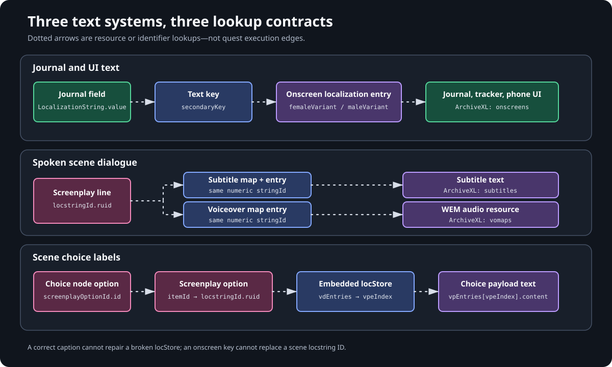

# Localization paths

Cyberpunk 2077 does not have one universal localization lookup. Journal and
onscreen UI, spoken scene lines, and player-choice labels resolve through three
different resource paths. A key that is valid in one path does nothing in the
other two.

| Record | Value |
| --- | --- |
| Chapter review date | 2026-08-09 |
| Practical baseline | Cyberpunk 2077 `2.31a`, WolvenKit `8.19.0`, ArchiveXL `1.27.0`, RED4ext `1.30.0`, redscript `0.5.31` |
| Lab 1 UI resource | Structure checked; verify presentation with the Lab 1 test guide |
| Vanilla scene references | **Observed in vanilla** |
| Complete retained localization fixture | **Runtime-proven** in a legacy environment, not in one fully bound pinned-book run |

> **Research note:** the exact resource types and joins below have been
> structurally inspected, and the choice-store shape is also supported by
> focused vanilla observations. A retained quest fixture displayed onscreen
> text, subtitles, voiceover, and all intended choice labels in game. That run
> did not bind the complete pinned toolchain and this book's Lab 1 payload into
> one evidence record, so it is not runtime proof for the pinned baseline.

## Choose the lookup by content owner

| Player-facing content | Source identifier | Runtime owner | ArchiveXL section |
| --- | --- | --- | --- |
| Quest title, objective, description, journal mappin, phone UI, or onscreen text | Textual `LocalizationString.value` | `localizationPersistenceOnScreenEntries` | `localization.onscreens.<locale>` |
| Spoken scene line | Numeric `scnlocLocstringId.ruid` | Subtitle map, subtitle entries, VO map, and WEM | `localization.subtitles.<locale>` and `localization.vomaps.<locale>` |
| Scene choice label | Numeric `scnlocLocstringId.ruid` reached through a screenplay option | The scene's embedded `scnlocLocStoreEmbedded` | None; it is inside the `.scene` |



The locale spellings also belong to different schemas. ArchiveXL uses a key
such as `en-us`; scene locStore descriptors use identifiers such as `en_us`,
`pl_pl`, and `db_db`. Do not normalize one spelling into the other.

## Path 1: journal and onscreen UI

A journal field whose RED type is `LocalizationString` stores a textual lookup
key in `value`. For example, Lab 1's objective has this join:

```text
gameJournalQuestObjective.description.value
  = cqa_cqa001_objective_wait
        |
        v
ArchiveXL localization.onscreens.en-us
        |
        v
localizationPersistenceOnScreenEntries.entries[]
  where secondaryKey = cqa_cqa001_objective_wait
        |
        v
femaleVariant, or a populated maleVariant override
```

`LocalizationString.unk1` appears beside `value` in a WolvenKit JSON export,
but it is not the textual join. The lookup key is not a scene RUID and should
not be converted into one.

### Exact onscreen resource shape

Under the `JsonResource` root, the decisive types and properties are:

| WolvenKit CR2W tree / JSON path | Type or value | Contract |
| --- | --- | --- |
| `Data.RootChunk` | `JsonResource` | Container for the localization payload |
| `Data.RootChunk.root.Data` | `localizationPersistenceOnScreenEntries` | Owns `entries[]` |
| `root.Data.entries[]` | `localizationPersistenceOnScreenEntry` | One merged onscreen string |
| `entries[].primaryKey` | `0` for mod-added textual keys | Keep the established mod-entry shape; an export may quote the zero |
| `entries[].secondaryKey` | Text string | Must equal the journal `LocalizationString.value` and be globally unique after all merges |
| `entries[].femaleVariant` | Text string | Default authored text in the validated shape |
| `entries[].maleVariant` | Text string | Optional gender-specific override; an empty value uses the established fallback convention |

A focused entry therefore has this shape; it is an excerpt, not a complete
CR2W resource:

```json
{
  "$type": "localizationPersistenceOnScreenEntry",
  "femaleVariant": "Wait for the signal.",
  "maleVariant": "",
  "primaryKey": "0",
  "secondaryKey": "cqa_cqa001_objective_wait"
}
```

Register the cooked depot resource, not the raw CR2W-JSON conversion source:

```yaml
localization:
  onscreens:
    en-us:
      - mod\cqa\cqa001\localization\en-us\onscreens\cqa001.json
```

The `.json` depot file above is a cooked `JsonResource`. A WolvenKit conversion
source commonly ends in `.json.json`; that source filename does not belong in
ArchiveXL.

### What Lab 1 proves

[Lab 1: First Signal](../start-here/lab-01.md) supplies a journal resource whose
keys all resolve to entries in one registered onscreen resource. WolvenKit
8.19.0 deserialized and round-tripped that structure, so the resource shape and
key inventory are **Structurally validated**.

Lab 1 deliberately uses populated `femaleVariant` values and empty
`maleVariant` values. The empty-override shape is structurally consistent with
the established fallback convention. Visible fallback and all Lab 1 text are
governed by the canonical runtime record. If the two variants intentionally
differ, test both player gender configurations rather than inferring one from
the other.

## Path 2: spoken scene lines

A spoken line uses one numeric localization ID, but two separately registered
resource branches consume it:

```text
scene screenplayStore.lines[].locstringId.ruid
        |
        +--> ArchiveXL localization.subtitles.en-us
        |      -> localizationPersistenceSubtitleMap
        |      -> entries[].subtitleFile
        |      -> localizationPersistenceSubtitleEntries
        |      -> entries[].stringId == line RUID
        |      -> femaleVariant / maleVariant subtitle text
        |
        +--> ArchiveXL localization.vomaps.en-us
               -> locVoiceoverMap
               -> locVoLineEntry.stringId == line RUID
               -> femaleResPath / maleResPath
               -> .wem audio resource
```

The exact resource fields are:

| Resource type | Decisive properties |
| --- | --- |
| `scnscreenplayDialogLine` in `screenplayStore.lines[]` | `locstringId.ruid`; its separate `itemId.id` is graph-local and is not the localization ID |
| `localizationPersistenceSubtitleMap` | `entries[]` |
| `localizationPersistenceSubtitleMapEntry` | `subtitleFile` resource reference; the inspected quest map also uses `subtitleGroup` value `quest` |
| `localizationPersistenceSubtitleEntries` | `entries[]` |
| `localizationPersistenceSubtitleEntry` | `stringId`, `femaleVariant`, and `maleVariant` |
| `locVoiceoverMap` | `entries[]` |
| `locVoLineEntry` | `stringId`, `femaleResPath`, and `maleResPath` |

The `stringId` in both external branches must preserve the same unsigned
numeric value as `locstringId.ruid`. Do not substitute the screenplay
`itemId.id`, truncate the value, or regenerate one branch independently.

ArchiveXL registers the subtitle *map* and the voiceover map separately. The
subtitle map then points to the subtitle-entry resource:

```yaml
localization:
  subtitles:
    en-us:
      - mod\myquest\localization\en-us\subtitles\my_scene_subtitles_map.json
  vomaps:
    en-us:
      - mod\myquest\localization\en-us\vo\my_scene.json
```

Putting the subtitle-entry file directly in `subtitles`, omitting the map, or
placing a choice ID in either external branch does not complete the intended
lookup.

**Runtime-proven boundary:** a retained legacy fixture resolved matching scene
RUIDs through both registered branches and played subtitles and VO. This
chapter documents that lookup contract, but it does not teach complete scene
graphs, WEM production, lipsync resources, or audio mastering. Those remain
deferred to the scene and audio work; copying this table is not a complete
spoken-dialogue implementation.

## Path 3: choice labels and the embedded locStore

Choice labels never pass through the external subtitle or onscreen tables. The
scene owns the complete join:

```text
scnChoiceNodeOption.screenplayOptionId.id
  -> screenplayStore.options[].itemId.id
  -> screenplayStore.options[].locstringId.ruid
  -> locStore.vdEntries[] matching localeId + locstringId + signature
  -> descriptor.vpeIndex
  -> locStore.vpEntries[vpeIndex].content
```

The corresponding RED types are:

| Location | Type | Decisive properties |
| --- | --- | --- |
| Choice node option | `scnChoiceNodeOption` | `screenplayOptionId.id`; `caption` is only an authoring/debug `CName` |
| Screenplay option | `scnscreenplayChoiceOption` | `itemId.id`, `locstringId.ruid` |
| Embedded store | `scnlocLocStoreEmbedded` | `vdEntries[]`, `vpEntries[]` |
| Descriptor | `scnlocLocStoreEmbeddedVariantDescriptorEntry` | `localeId`, `locstringId.ruid`, `signature.val`, `variantId.ruid`, `vpeIndex` |
| Payload | `scnlocLocStoreEmbeddedVariantPayloadEntry` | `content`, `variantId.ruid` |

`caption` can make a choice node understandable in WolvenKit, but it is not
the authoritative displayed label and is not a reliable fallback. A retained
bad fixture had the intended `caption` while the player saw a stale label from
the locStore.

There is no ArchiveXL localization section for this path. The locStore is
embedded in the `.scene`; adding its numeric ID to onscreens, subtitles, or
vomaps cannot repair the choice lookup.

### Preserve descriptor-to-payload identity

`vpeIndex` is zero-based and must still point at the intended element of
`vpEntries[]`. The descriptor and its payload also carry the same
`variantId.ruid`. If entries move, move the descriptor/payload relationship
deliberately and recalculate every affected `vpeIndex`; a serialize/deserialize
round trip does not repair a mismatched table.

Treat all scene localization and variant RUIDs as unsigned 64-bit values.
Sorting their decimal spellings as text is wrong: for example, `100` sorts
before `20` lexicographically even though its numeric value is larger.

### Bound the ordering claim

The known-good authoring shape is deliberately narrower than a universal
engine rule:

1. Keep `vdEntries[]` in contiguous locale blocks.
2. Within each locale block, sort descriptors by the unsigned numeric value of
   `locstringId.ruid`.
3. Keep descriptors with the same locale and locstring ID adjacent while
   preserving each descriptor's `vpeIndex` and `variantId` relationship.
4. Mirror the locale coverage and variant shape of a comparable vanilla scene;
   do not invent a new locale order from the labels in this chapter.

Four focused references showed locale-grouped descriptors and ascending
unsigned locstring IDs within each locale block. These findings are
**Observed in vanilla**:

- `base\quest\minor_quests\mq003\scenes\mq003_01_homeless.scene`
- `base\quest\minor_quests\mq003\scenes\mq003_03_orbital_pod.scene`
- `base\quest\minor_quests\mq007\scenes\mq007_01_gun_found.scene`
- `base\quest\minor_quests\mq010\scenes\mq010_02_barry_talk.scene`

A retained custom fixture used locale blocks `db_db`, `pl_pl`, then `en_us`.
Its unsorted build produced blank and stale rows; the numerically sorted build
displayed all intended labels. That result is **Runtime-proven** for the legacy
fixture and supports this known-good shape, but it does not prove that numeric
sorting is a universal engine theorem for every scene or locale set.

The same fixture keeps duplicate `db_db` entries blank-before-source. That is
fixture-specific, not a vanilla-wide rule: the audited scenes also contain
source-before-blank pairs. Preserve the exact variant-to-payload mapping you
derived from a comparable reference instead of enforcing blank-first as a
general rule.

Use the disposable workflow in [Inspect a vanilla questphase](../start-here/inspecting-vanilla.md)
to open these scene depot paths from your own installed archives. Record only
the focused `locStore`, option IDs, types, and ordering needed for comparison.
Do not add extracted scenes to a distributable project or publish their cooked
files or complete JSON exports.

Full scene construction remains deferred. The lookup contract above does not
cover actors, sections, events, lipsync, scene lifecycle, or questphase launch
and return paths.

## Diagnose the chain that owns the symptom

| Symptom | First checks |
| --- | --- |
| Journal title or objective is blank | Compare `LocalizationString.value` with `secondaryKey`; confirm globally unique key, `primaryKey: 0`, and `localization.onscreens.<locale>` registration |
| UI text works for one player variant only | Inspect both `femaleVariant` and `maleVariant`; repeat runtime acceptance with both intended configurations |
| Spoken subtitle is missing | Compare line RUID with subtitle `stringId`; confirm ArchiveXL registers the subtitle map and that `subtitleFile` resolves |
| Subtitle displays but audio is silent | Compare the same RUID with `locVoLineEntry.stringId`, then resolve both WEM paths and inspect runtime logs |
| Choice node caption is correct but the menu is blank or stale | Follow option ID to screenplay option, then descriptor to payload; inspect locale grouping, unsigned numeric ordering, `vpeIndex`, and `variantId` |
| Only one scene locale is wrong | Inspect that locale block and its payload indices; do not rewrite the external onscreen or subtitle table |

Packing without errors proves only that the resources serialized. It does not
prove that the joins resolve at runtime.

## Verification and save boundary

Before claiming a path works:

1. deserialize each mod-owned CR2W-JSON source with WolvenKit 8.19.0;
2. serialize it back and compare the decisive types, IDs, depot paths, array
   order, and descriptor/payload indices;
3. verify every textual or numeric join before packing;
4. inspect ArchiveXL and game logs for registration, missing-resource, and
   lookup errors;
5. run journal tests from a pre-install save and scene tests from a save made
   before that scene became active;
6. save and reload during active and completed states, then repeat from the
   original clean save.

Journal activation and visited state, quest facts, graph checkpoints, and
active scene state are save-backed. Resetting a fact does not clear the other
records. Use the full matrix in [Facts, journals, and saves](../foundations/persistent-state.md)
and [Install, test, and reset](../start-here/install-and-test.md), and record the
exact payload hashes, save provenance, versions, and observed result.
