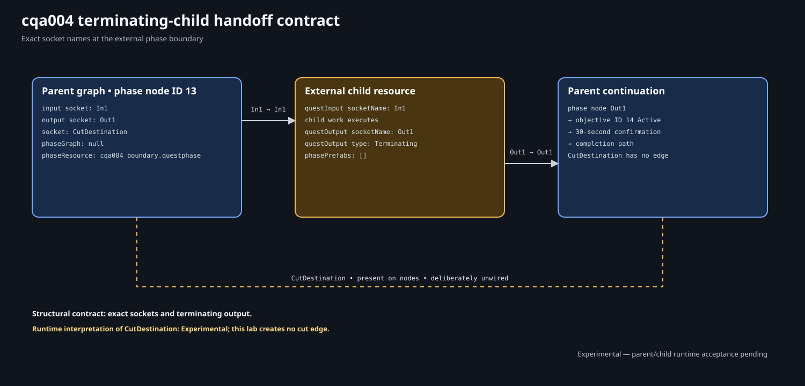

# Author Handoff Point in WolvenKit

This walkthrough expands the supplied Lab 4 start checkpoint into the exact
12-node parent and 10-node child. The start project already contains every
world, journal, localization, registration, and phase resource so the work can
focus on the native composition boundary.

You edit resources in WolvenKit. The repository's generation, validation, and
diagram scripts are documentation-author infrastructure, not reader
prerequisites and not an alternate quest authoring system.

| Record | Value |
| --- | --- |
| Procedure review date | 2026-08-09 |
| Structural validation date | 2026-08-09 |
| Runtime test date | Not yet recorded |

## Required environment

| Component | Exact version |
| --- | --- |
| Cyberpunk 2077 for Windows (GOG) | `2.31a` (public patch `2.31`) |
| WolvenKit | `8.19.0` |
| ArchiveXL | `1.27.0` |
| RED4ext | `1.30.0` |
| redscript | `0.5.31` |

Use an untouched save created before any Lab 4 candidate was installed for
runtime testing. A manually edited `_Start` project is useful for learning and
comparison, but only the unmodified completed checkpoint is the canonical
acceptance candidate.

## 1. Open and isolate the checkpoint

1. Download and extract [the start ZIP](../downloads/cqa-lab-04-start.zip).
2. Open `CQA_Lab04_HandoffPoint_Start.cpmodproj` with **File > Open
   Project**.
3. Make an untouched backup of the extracted directory.
4. Confirm `source\archive` and `source\raw` each contain the seven depot
   resources listed in [the overview](lab-04.md#resource-ownership).
5. Confirm `CQA_Lab04_HandoffPoint_Start.archive.xl` is under
   `source\resources`.
6. Do not install the start and completed checkpoints together.

The start parent is `[0] Input -> [13] Phase -> [1] Output`. The start child is
`[0] Input -> [1] Output`. Both output nodes use `socketName: Out1` and
`type: Terminating`.

## 2. Audit registration before graph work

Open the ArchiveXL file and retain these four sections:

```yaml
quest:
  phases:
  - path: mod\cqa\cqa004\phases\cqa004.questphase
    parent: base\quest\cyberpunk2077.quest

journal:
- mod\cqa\cqa004\journal\cqa004.journal

localization:
  onscreens:
    en-us:
    - mod\cqa\cqa004\localization\en-us\onscreens\cqa004.json

streaming:
  blocks:
  - mod\cqa\cqa004\world\cqa004_handoff.streamingblock
```

Do not add `cqa004_boundary.questphase` to `quest.phases`. It is an archived
child resolved by the parent, not a second root. Do not add the two sectors to
a guessed top-level registration list; the block descriptors reach them.

## 3. Audit all seven native resources

Before changing either graph, identify each supplied owner:

| Resource | Check |
| --- | --- |
| `cqa004.questphase` | Registered root, one `phasePrefabs` entry, external phase node |
| `cqa004_boundary.questphase` | Unregistered external child, empty `phasePrefabs` |
| `cqa004.journal` | Quest, phase, reach, leave, confirmation, and map-pin entries |
| `cqa004.json` | Five exact secondary keys and English strings |
| `cqa004_handoff.streamingblock` | Quest-sector and AlwaysLoaded-sector descriptors |
| `cqa004_handoff.streamingsector` | Two trigger nodes, placements, refs, and outlines |
| `cqa004_always_loaded.streamingsector` | Static marker, placement, and marker ref |

The checkpoint includes cooked resources for direct WolvenKit editing and raw
CR2W-JSON for focused review. Do not edit the JSON as the tutorial workflow.

## 4. Audit journal and localization ownership

Open `cqa004.journal` and confirm this typed tree:

```text
gameJournalRootFolderEntry
└── quests                         gameJournalPrimaryFolderEntry
    └── minor_quest                gameJournalFolderEntry
        └── cqa004                 gameJournalQuest
            └── cqa004_01          gameJournalQuestPhase
                ├── cqa004_01_obj_reach
                │   └── cqa004_01_qmp_handoff
                ├── cqa004_01_obj_leave
                └── cqa004_01_obj_confirm
```

The map pin's `reference` is `#cqa004_mp_handoff`. Open the localization
resource and confirm:

| Secondary key | English value |
| --- | --- |
| `cqa_cqa004_title` | `Handoff Point` |
| `cqa_cqa004_objective_reach` | `Reach the handoff point.` |
| `cqa_cqa004_objective_leave` | `Clear the handoff area.` |
| `cqa_cqa004_objective_confirm` | `Wait for handoff confirmation.` |
| `cqa_cqa004_mappin_handoff` | `Handoff Point` |

The child later changes reach, pin, and leave state. The parent later changes
quest, phase, and confirmation state. Neither phase owns the strings.

## 5. Audit prefab scope and world resources

Open the root phase's top-level `phasePrefabs` and retain exactly one
`questQuestPrefabEntry`:

```text
#cqa004_pr_handoff
```

Open the child and confirm `phasePrefabs: []`. Open parent phase node `13` and
confirm `phaseInstancePrefabs: []`. Do not duplicate the root into either
empty list.

The streaming block's Quest descriptor uses full root:

```text
$/mod/cqa/cqa004/#cqa004_pr_handoff
```

The two sector resources supply these full child refs:

```text
$/mod/cqa/cqa004/#cqa004_pr_handoff/#cqa004_tr_reach
$/mod/cqa/cqa004/#cqa004_pr_handoff/#cqa004_tr_leave
$/mod/cqa/cqa004/#cqa004_pr_handoff/#cqa004_mp_handoff
```

The trigger geometry and marker placement intentionally match Lab 3. Confirm
their values against [the Lab 4 overview](lab-04.md#world-and-journal-scaffold)
instead of changing location and phase ownership in the same experiment.

## 6. Audit the existing external phase node

Open `cqa004.questphase`, select node `13`, and inspect its serialized
properties:

| Property | Exact value |
| --- | --- |
| RED type | `questPhaseNodeDefinition` |
| `phaseGraph` | null |
| `phaseInstancePrefabs` | empty |
| `phaseResource.DepotPath` | `mod\cqa\cqa004\phases\cqa004_boundary.questphase` |
| `phaseResource.Flags` | `Soft` |
| `saveLock` | `0` |
| `unfreezingTriggerNodeRef` | zero NodeRef |
| interface sockets | input `In1`, output `Out1` |
| interruption socket | `CutDestination`, unwired |

Open the child and confirm input node `0` exposes `socketName: In1`, output
node `1` exposes `socketName: Out1`, and output type is `Terminating`.



The figure shows both interface layers and the present-but-unwired
`CutDestination`. Do not connect cut to the terminating output as a shortcut.

## 7. Add and number parent nodes

Keep parent nodes `0`, `1`, and `13`. Add these nine nodes:

| Target ID | Add Node label | RED type |
| ---: | --- | --- |
| `10` | `Condition` | `questConditionNodeDefinition` |
| `11` | `Journal` | `questJournalNodeDefinition` |
| `12` | `Journal` | `questJournalNodeDefinition` |
| `14` | `Journal` | `questJournalNodeDefinition` |
| `15` | `PauseCondition` | `questPauseConditionNodeDefinition` |
| `16` | `Journal` | `questJournalNodeDefinition` |
| `17` | `Journal` | `questJournalNodeDefinition` |
| `18` | `FactsDBManager` | `questFactsDBManagerNodeDefinition` |
| `19` | `Journal` | `questJournalNodeDefinition` |

WolvenKit may assign lower automatic IDs. Renumber safely in two passes: move
new nodes to temporary IDs `100`–`108`, then move them to the targets. Never
overwrite an ID still owned by another node. Save, close, reopen, and confirm
the inventory before wiring.

## 8. Configure the parent guard and fact write

At parent ID `10`, add `questFactsDBCondition`, then
`questVarComparison_ConditionType`:

| Property | Value |
| --- | --- |
| `factName` | `cqa004_completed` |
| `comparisonType` | `Equal` |
| `value` | `0` |

At parent ID `18`, choose `questSetVar_NodeType`:

| Property | Value |
| --- | --- |
| `factName` | `cqa004_completed` |
| `setExactValue` | `1` |
| `value` | `1` |

The exact write occurs only after child return and confirmation. Do not add a
second fact to the child.

## 9. Configure parent journal operations

For parent Journal nodes, add `questJournalQuestEntry_NodeType` and a typed
`gameJournalPath`. Keep these common values:

| Property | Value |
| --- | --- |
| `optional` | `0` |
| `sendNotification` | `1` |
| `trackQuest` | `1` |
| `version` | `Initial` |
| `path.editorPath` | empty |
| `path.fileEntryIndex` | `2` |

| IDs | `className` | `realPath` | Connected state |
| --- | --- | --- | --- |
| `11`, `19` | `gameJournalQuest` | `quests/minor_quest/cqa004` | `11.Active`, `19.Succeeded` |
| `12`, `17` | `gameJournalQuestPhase` | `quests/minor_quest/cqa004/cqa004_01` | `12.Active`, `17.Succeeded` |
| `14`, `16` | `gameJournalQuestObjective` | `quests/minor_quest/cqa004/cqa004_01/cqa004_01_obj_confirm` | `14.Active`, `16.Succeeded` |

Incoming state sockets choose the requested journal state. The repeated path
does not make the nodes redundant.

## 10. Configure the parent confirmation delay

At parent ID `15`, add `questTimeCondition`, then
`questRealtimeDelay_ConditionType`:

| Property | Value |
| --- | ---: |
| `hours` | `0` |
| `minutes` | `0` |
| `seconds` | `30` |
| `miliseconds` | `0` |

The 30-second realtime window makes the returned parent owner observable and
provides a dedicated post-return reload case. It is not child cleanup.

## 11. Wire the exact parent graph

Right-click nodes and use **Show Unused Sockets**, then create these twelve
ordinary edges:

| Source | Destination |
| --- | --- |
| `0.Out` | `10.In` |
| `10.False` | `1.In` |
| `10.True` | `11.Active` |
| `11.Out` | `12.Active` |
| `12.Out` | `13.In1` |
| `13.Out1` | `14.Active` |
| `14.Out` | `15.In` |
| `15.Out` | `16.Succeeded` |
| `16.Out` | `17.Succeeded` |
| `17.Out` | `18.In` |
| `18.Out` | `19.Succeeded` |
| `19.Out` | `1.In` |

The decisive handoff edge is `13.Out1 -> 14.Active`. Leave every
`CutDestination` unwired.

Save, close, reopen, then compare against the
[exact parent graph](lab-04.md#exact-root-phase). Canvas position and handle
IDs are not behavior.

## 12. Add and number child nodes

Open `cqa004_boundary.questphase`. Keep nodes `0` and `1`, then add:

| Target ID | Add Node label | RED type |
| ---: | --- | --- |
| `10` | `Journal` | `questJournalNodeDefinition` |
| `11` | `MappinManager` | `questMappinManagerNodeDefinition` |
| `12` | `PauseCondition` | `questPauseConditionNodeDefinition` |
| `13` | `MappinManager` | `questMappinManagerNodeDefinition` |
| `14` | `Journal` | `questJournalNodeDefinition` |
| `15` | `Journal` | `questJournalNodeDefinition` |
| `16` | `PauseCondition` | `questPauseConditionNodeDefinition` |
| `17` | `Journal` | `questJournalNodeDefinition` |

Use temporary IDs `100`–`107` before assigning final IDs. Save and reopen the
child before adding connections.

## 13. Configure child journal operations

Use the same common journal values as the parent. Configure:

| IDs | `className` | `realPath` | Connected state |
| --- | --- | --- | --- |
| `10`, `14` | `gameJournalQuestObjective` | `quests/minor_quest/cqa004/cqa004_01/cqa004_01_obj_reach` | `10.Active`, `14.Succeeded` |
| `15`, `17` | `gameJournalQuestObjective` | `quests/minor_quest/cqa004/cqa004_01/cqa004_01_obj_leave` | `15.Active`, `17.Succeeded` |

Child node `17` succeeds its local objective before the terminating output. It
does not succeed the parent phase or root quest.

## 14. Configure child map-pin operations

Both Mappin Manager nodes use:

| Property | Value |
| --- | --- |
| `path.className` | `gameJournalQuestMapPin` |
| `path.realPath` | `quests/minor_quest/cqa004/cqa004_01/cqa004_01_obj_reach/cqa004_01_qmp_handoff` |
| `path.fileEntryIndex` | `2` |
| `path.editorPath` | empty |
| `disablePreviousMappins` | `0` |

Node `11` receives `Active`; node `13` receives `Inactive`. They address the
same journal map pin. This isolated lab has no deliberate prior route to
replace.

## 15. Configure child trigger waits

At each Pause Condition, add `questTriggerCondition`:

| ID | `condition.type` | `triggerAreaRef` |
| ---: | --- | --- |
| `12` | `IsInside` | `#cqa004_tr_reach` |
| `16` | `IsOutside` | `#cqa004_tr_leave` |

Set `isPlayerActivator: 1`. Leave `activatorRef` as the ordinary empty
`gameEntityReference`. These are state-shaped waits, not `Entered`/`Exited`
transition events.

The refs are local to `#cqa004_pr_handoff`, which is declared by the parent
root. Keep child `phasePrefabs` empty for this lab.

## 16. Wire the exact child graph

Use **Show Unused Sockets**, then create these nine ordinary edges:

| Source | Destination |
| --- | --- |
| `0.Out` | `10.Active` |
| `10.Out` | `11.Active` |
| `11.Out` | `12.In` |
| `12.Out` | `13.Inactive` |
| `13.Out` | `14.Succeeded` |
| `14.Out` | `15.Active` |
| `15.Out` | `16.In` |
| `16.Out` | `17.Succeeded` |
| `17.Out` | `1.In` |

Leave every `CutDestination` unwired. Save, close, reopen, and compare with the
[exact child graph](lab-04.md#exact-boundary-child-phase).

## 17. Review the two resources together

Confirm all of the following before building:

1. parent node `13.In1` matches child input `socketName: In1`;
2. child output `socketName: Out1` is terminating;
3. parent node `13.Out1` connects only to parent `14.Active`;
4. `phaseResource` is soft and matches the archived child path exactly;
5. `phaseGraph` is null;
6. parent phase-node instance prefabs and child root prefabs are empty;
7. only the root declares `#cqa004_pr_handoff`;
8. no edge uses `CutDestination`;
9. the child is absent from ArchiveXL `quest.phases`.

The exact contract figure should now match the resources:


## 18. Validate, build, and install

With every tab saved:

1. run **Project > Scan for broken file references**;
2. run **Project > Scan for broken files**;
3. run **Project > Run File Validation on the entire project**;
4. resolve all project-owned errors;
5. close Cyberpunk 2077;
6. choose **Build > Install** and wait for packing and installation;
7. inspect WolvenKit's Log panel and both installed files.

Use the normal ArchiveXL project install, not **Install as REDmod**. A packed
archive without its loose `.archive.xl` cannot attach the root, merge the
journal/localization, or register the world block.

The manually expanded start project installs `_Start`-named files and is a
comparison candidate. Evidence that promotes the book must use the supplied,
unmodified `CQA_Lab04_HandoffPoint.cpmodproj`, bind these installed files, and
follow its acceptance record:

```text
archive\pc\mod\CQA_Lab04_HandoffPoint.archive
archive\pc\mod\CQA_Lab04_HandoffPoint.archive.xl
```

## Common authoring failures

| Symptom | Check |
| --- | --- |
| Parent activates but child does not | Exact soft depot path, packed child, null `phaseGraph`, matching `In1`, and logs |
| Child finishes but confirmation does not start | Child output reachability, terminating `Out1`, and `13.Out1 -> 14.Active` |
| Trigger refs fail after the split | Parent root prefab entry, empty child/instance lists, world full root, and exact child refs |
| Both phases start independently | Remove the child from ArchiveXL `quest.phases`; only the root is registered |
| Completion bypass runs too early | Confirm guard is `Equal 0` and fact write occurs at parent ID `18` |
| Cut seems to terminate normally | Remove the guessed cut edge; Lab 4 leaves every cut socket unwired |
| Graph changes after reopen | Renumber through temporary IDs, save/reopen before wiring, then compare semantics |
| Canonical hashes do not match | Use the unmodified completed checkpoint; a manually expanded `_Start` build is not byte-identical evidence |

Lab sequence: [All labs](../reference/labs-at-a-glance.md) · Previous: [Lab 4:
Handoff Point](lab-04.md) · Next: [Test Handoff Point](lab-04-test.md).
