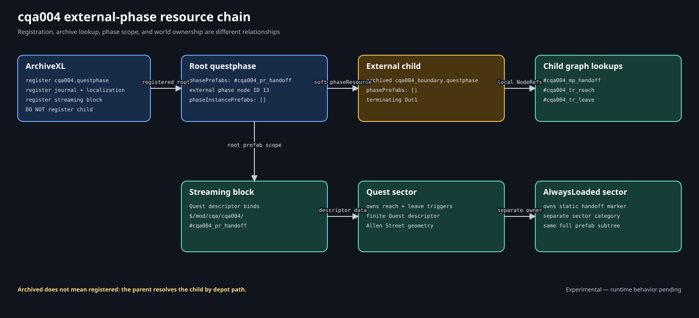
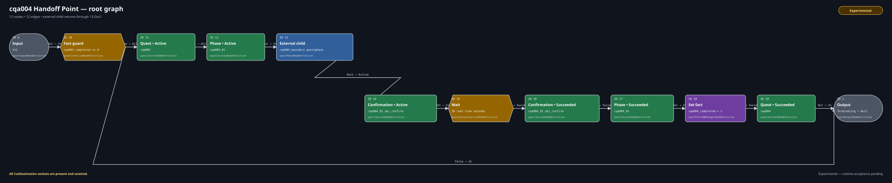
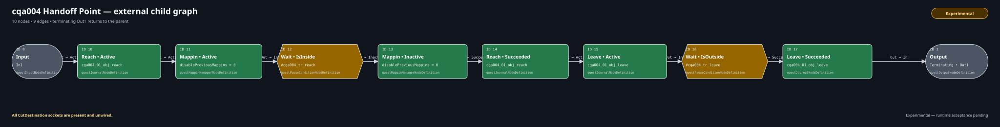

# Lab 4: Handoff Point

Lab 4 moves Boundary Check's reach/leave activity into an external child
questphase. The registered root starts the child, waits for its `Out1` return,
then performs a visible parent-only confirmation before completing the quest.

| Record | Value |
| --- | --- |
| Procedure review date | 2026-08-09 |
| Structural validation date | 2026-08-09 |
| Runtime test date | Not yet recorded |

**Implementation status:** both supplied seven-resource checkpoints are
**Structurally validated** with WolvenKit `8.19.0`. Their parent and child
CR2W types, soft child path, socket contracts, graphs, prefab lists, NodeRefs,
journal paths, world records, and registration boundary are exact. Runtime
mounting, child entry, return, streaming, and save/reload behavior remain
governed by the synchronized acceptance record.

Follow [Author Handoff Point in WolvenKit](lab-04-authoring.md) to expand the
start checkpoint. Then use [Test Handoff Point](lab-04-test.md) to bind the
candidate, saves, observations, and logs.

## What the lab demonstrates


```text
registered root -> completed == 0?
  False -> terminate
  True  -> activate quest and phase
        -> enter external child through In1
             activate reach objective and pin
             wait IsInside reach volume
             retire pin; succeed reach; activate leave
             wait IsOutside leave volume
             succeed leave; terminate child through Out1
        <- parent phase node emits Out1
        -> activate confirmation objective
        -> wait 30 realtime seconds
        -> succeed confirmation and phase
        -> set completed = 1
        -> succeed quest; terminate root
```

The `CutDestination` socket exists on the external phase node and other
relevant nodes, but every cut socket is deliberately unwired. Lab 4 teaches a
normal terminating `Out1` handoff only; cut behavior remains **Experimental**.

## Required environment

| Component | Exact version |
| --- | --- |
| Cyberpunk 2077 for Windows (GOG) | `2.31a` (public patch `2.31`) |
| WolvenKit | `8.19.0` |
| ArchiveXL | `1.27.0` |
| RED4ext | `1.30.0` |
| redscript | `0.5.31` |

Other versions may expose different editor wrappers or runtime behavior.

## Prerequisites and downloads

Complete [Lab 3](../world/lab-03.md), then read:

- [Registering a root questphase](root-registration.md);
- [Inputs and outputs](inputs-and-outputs.md);
- [Calling child phases](child-phases.md);
- [Prefab dependencies](prefab-dependencies.md);
- [Completion and interruption](completion-and-cut.md).

- [Download the start checkpoint](../downloads/cqa-lab-04-start.zip). It has
  the complete seven-resource scaffold, a three-node root, and a two-node
  pass-through child.
- [Download the completed checkpoint](../downloads/cqa-lab-04-completed.zip).
  It has the same resources, the exact 12-node root, and the exact 10-node
  child.

Do not install the two checkpoints together. They register and pack the same
depot paths. Use an untouched save created before any Lab 4 candidate was
first installed. Uninstalling an earlier candidate or setting
`cqa004_completed = 0` does not remove save-backed journal, phase, mappin,
world, or graph state.

## Resource ownership



| Resource | Depot path | Owns |
| --- | --- | --- |
| Root questphase | `mod\cqa\cqa004\phases\cqa004.questphase` | Root graph, completion policy, external child call, and root prefab declaration |
| Boundary child questphase | `mod\cqa\cqa004\phases\cqa004_boundary.questphase` | Reach/leave activity and terminating `Out1` |
| Journal | `mod\cqa\cqa004\journal\cqa004.journal` | Quest, phase, three objectives, and handoff map pin |
| Onscreen localization | `mod\cqa\cqa004\localization\en-us\onscreens\cqa004.json` | Quest title, three objective strings, and pin caption |
| Streaming block | `mod\cqa\cqa004\world\cqa004_handoff.streamingblock` | Quest and AlwaysLoaded sector descriptors |
| Quest sector | `mod\cqa\cqa004\world\cqa004_handoff.streamingsector` | Reach and leave trigger definitions and placements |
| AlwaysLoaded sector | `mod\cqa\cqa004\world\cqa004_always_loaded.streamingsector` | Static handoff marker definition and placement |
| ArchiveXL registration | `CQA_Lab04_HandoffPoint.archive.xl` | Root attachment, journal/localization merge, and streaming-block registration |

The loose ArchiveXL file is packaging metadata, not an eighth CR2W resource.
ArchiveXL registers the streaming block, not its sectors separately.

## Registration and child resolution

The ArchiveXL file registers only the root phase:

```yaml
quest:
  phases:
  - path: mod\cqa\cqa004\phases\cqa004.questphase
    parent: base\quest\cyberpunk2077.quest

journal:
- mod\cqa\cqa004\journal\cqa004.journal

localization:
  onscreens:
    en-us:
    - mod\cqa\cqa004\localization\en-us\onscreens\cqa004.json

streaming:
  blocks:
  - mod\cqa\cqa004\world\cqa004_handoff.streamingblock
```

Parent phase node `13` resolves the child through:

```text
phaseGraph: null
phaseResource:
  DepotPath: mod\cqa\cqa004\phases\cqa004_boundary.questphase
  Flags: Soft
phaseInstancePrefabs: []
saveLock: 0
unfreezingTriggerNodeRef: 0
```

The child is packed but not independently ArchiveXL-registered. The supplied
validator rejects a child registration entry.

## Prefab and NodeRef contract

The registered root declares one local prefab root:

```text
#cqa004_pr_handoff
```

The external child declares:

```text
phasePrefabs: []
```

The world-side full root and nested references are:

```text
$/mod/cqa/cqa004/#cqa004_pr_handoff
  #cqa004_tr_reach
  #cqa004_tr_leave
  #cqa004_mp_handoff
```

The child directly uses the two local trigger refs. Its empty prefab list is
intentional: Lab 4 tests root-owned scope across the child boundary. The
arrangement is **Structurally validated** here, **Observed in vanilla** in the
cited street-story pair, and **Runtime-proven** in the retained four-child
GQT003 fixture. Lab 4's own runtime result remains **Experimental**.

## World and journal scaffold

The world resources reuse Lab 3's checked geometry under the `cqa004`
namespace:

| Owner | Node | Placement | Geometry or orientation |
| --- | --- | --- | --- |
| Quest sector | `worldTriggerAreaNode` reach | `(-1000.02, 1497.2208, 2.3)` | 16-point regular outline, 25 m circumradius, 12 m high |
| Quest sector | `worldTriggerAreaNode` leave | `(-1000.02, 1497.2208, 0.3)` | 20-point regular outline, 110 m circumradius, 16 m high |
| AlwaysLoaded sector | `worldStaticMarkerNode` | `(-1000.02, 1497.2208, 8.3)` | yaw `88.6°` |

The typed journal tree is:

```text
quests/minor_quest/cqa004
└── cqa004_01
    ├── cqa004_01_obj_reach
    │   └── cqa004_01_qmp_handoff -> #cqa004_mp_handoff
    ├── cqa004_01_obj_leave
    └── cqa004_01_obj_confirm
```

The child owns the first two objectives and map pin. The parent owns the
confirmation objective. The only FactsDB name is `cqa004_completed`.

## Start checkpoint contract

The start root already teaches external resolution without the completed
behavior:

| Root ID | RED type | Purpose |
| ---: | --- | --- |
| `0` | `questInputNodeDefinition` | Expose root `In1` |
| `13` | `questPhaseNodeDefinition` | Resolve child and match `In1`/`Out1` |
| `1` | `questOutputNodeDefinition` | Terminate root through `Out1` |

Its two edges are `0.Out -> 13.In1` and `13.Out1 -> 1.In`.

The start child contains `[0] Input` and `[1] Output`, connected by
`0.Out -> 1.In`. Output `1` is `Terminating`. This pass-through is a checkpoint
for inspecting both interface layers; it is not the completed player activity.

## Exact root phase



| ID | RED node type | Decisive payload | Purpose |
| ---: | --- | --- | --- |
| `0` | `questInputNodeDefinition` | interface `In1` | Enter registered root |
| `1` | `questOutputNodeDefinition` | terminating `Out1` | End success and bypass routes |
| `10` | `questConditionNodeDefinition` | `cqa004_completed Equal 0` | Bypass a completed save |
| `11` | `questJournalNodeDefinition` | quest path | Activate Handoff Point |
| `12` | `questJournalNodeDefinition` | phase path | Activate phase |
| `13` | `questPhaseNodeDefinition` | soft child path; null inline graph; empty instance prefabs | Invoke Boundary child through `In1` and receive `Out1` |
| `14` | `questJournalNodeDefinition` | confirmation objective | Prove parent-only continuation became active |
| `15` | `questPauseConditionNodeDefinition` | 30-second realtime delay | Keep the post-return parent window observable |
| `16` | `questJournalNodeDefinition` | confirmation objective | Succeed confirmation |
| `17` | `questJournalNodeDefinition` | phase path | Succeed phase |
| `18` | `questFactsDBManagerNodeDefinition` | set `cqa004_completed = 1` exactly | Persist one-shot completion |
| `19` | `questJournalNodeDefinition` | quest path | Succeed Handoff Point |

### Root edge contract

| Source | Destination | Meaning |
| --- | --- | --- |
| `0.Out` | `10.In` | Enter completion guard |
| `10.False` | `1.In` | Completed-save bypass |
| `10.True` | `11.Active` | First-run activation |
| `11.Out` | `12.Active` | Activate phase |
| `12.Out` | `13.In1` | Enter external child |
| `13.Out1` | `14.Active` | Resume parent after normal child return |
| `14.Out` | `15.In` | Begin visible parent-only window |
| `15.Out` | `16.Succeeded` | End confirmation wait |
| `16.Out` | `17.Succeeded` | Succeed phase |
| `17.Out` | `18.In` | Write durable completion |
| `18.Out` | `19.Succeeded` | Succeed quest |
| `19.Out` | `1.In` | Terminate successful root route |

## Exact boundary child phase



| ID | RED node type | Decisive payload | Purpose |
| ---: | --- | --- | --- |
| `0` | `questInputNodeDefinition` | interface `In1` | Receive parent invocation |
| `1` | `questOutputNodeDefinition` | terminating `Out1` | Return normal completion |
| `10` | `questJournalNodeDefinition` | reach objective | Activate reach objective |
| `11` | `questMappinManagerNodeDefinition` | pin path; disable previous `0` | Activate and track handoff pin |
| `12` | `questPauseConditionNodeDefinition` | player `IsInside #cqa004_tr_reach` | Wait for current inside state |
| `13` | `questMappinManagerNodeDefinition` | same pin path; disable previous `0` | Inactivate handoff pin |
| `14` | `questJournalNodeDefinition` | reach objective | Succeed reach objective |
| `15` | `questJournalNodeDefinition` | leave objective | Activate leave objective |
| `16` | `questPauseConditionNodeDefinition` | player `IsOutside #cqa004_tr_leave` | Wait for current outside state |
| `17` | `questJournalNodeDefinition` | leave objective | Succeed leave objective before return |

### Child edge contract

| Source | Destination | Meaning |
| --- | --- | --- |
| `0.Out` | `10.Active` | Begin child-owned activity |
| `10.Out` | `11.Active` | Activate pin |
| `11.Out` | `12.In` | Arm reach condition |
| `12.Out` | `13.Inactive` | Retire pin after reach |
| `13.Out` | `14.Succeeded` | Succeed reach objective |
| `14.Out` | `15.Active` | Activate leave objective |
| `15.Out` | `16.In` | Arm leave condition |
| `16.Out` | `17.Succeeded` | Succeed leave objective |
| `17.Out` | `1.In` | Terminate child through `Out1` |

No root edge reaches a child node directly. No child edge reaches a parent node
directly. Phase node `13` and the matching interface names are the handoff.

## Common failure modes

| Symptom | Check first | Boundary |
| --- | --- | --- |
| Quest never appears | Root path in `.archive.xl`, installed archive pair, ArchiveXL/RED4ext logs | The child is not an additional root registration |
| Quest activates but child work never starts | Node `13` soft path, archived child, parent `In1`, child `socketName: In1` | A valid parent CR2W does not prove external resolution |
| Child finishes but confirmation never appears | Child output reachability, child `socketName: Out1`, parent `13.Out1 -> 14.Active` | Journal success is not implicit parent continuation |
| Trigger refs fail only in child | Root prefab entry, empty child/instance lists, full world binding, exact candidate hashes | Do not “fix” by duplicating until the tested arrangement is diagnosed |
| Reload restarts or skips work | Save provenance, active owner at save time, fact write order, journal state | A console fact reset is not a clean save |
| An interruption route behaves unpredictably | Confirm every `CutDestination` remains unwired | Lab 4 makes no cut-safety claim |

Lab sequence: [All labs](../reference/labs-at-a-glance.md) · Previous topic:
[Complex cleanup, interruption, and
cancellation](cleanup-interruption-and-cancellation.md) · Next: [Author
Handoff Point in WolvenKit](lab-04-authoring.md).
