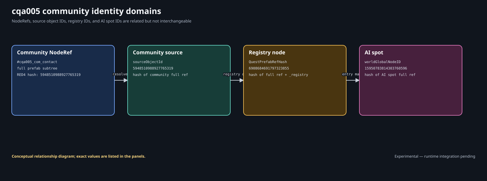
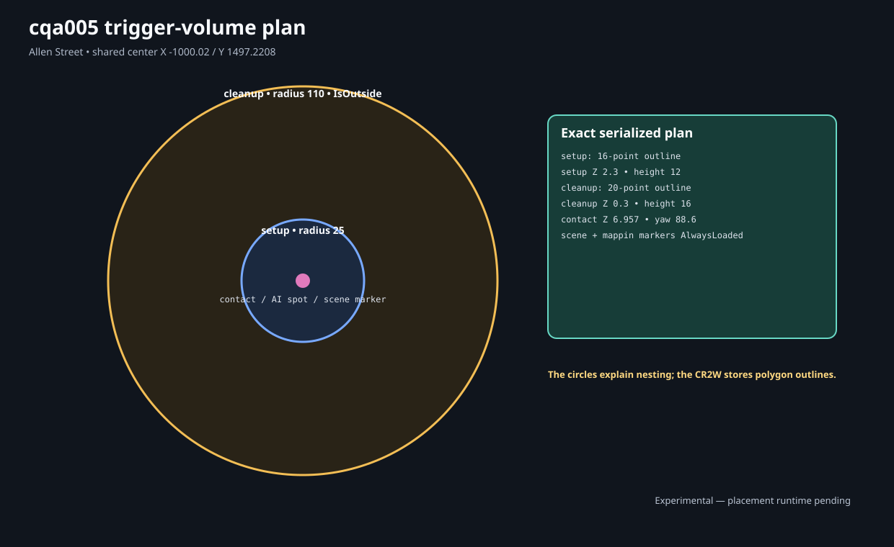
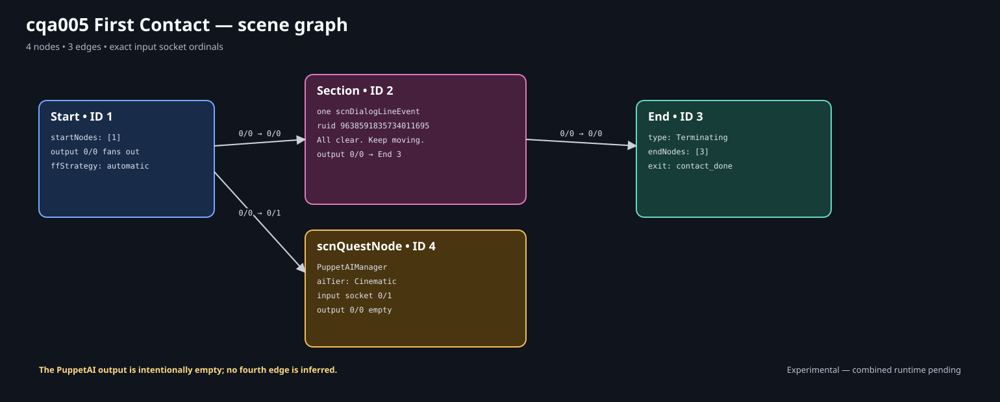
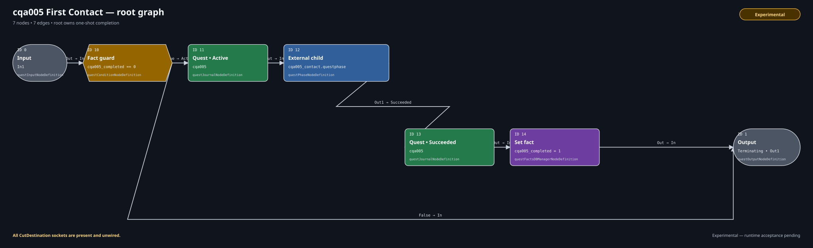

# Author First Contact in WolvenKit

This walkthrough expands the supplied Lab 5 start checkpoint into the exact
root, contact child, and one-line scene in the completed checkpoint. The start
project already contains every world, journal, localization, audio, and
registration resource so each owner can be inspected before execution is
added.

You edit native resources in WolvenKit. The repository's generators,
validators, and diagram renderer are documentation-author infrastructure, not
reader prerequisites and not an alternate quest authoring system.

| Record | Value |
| --- | --- |
| Procedure review date | 2026-08-09 |
| Structural validation date | 2026-08-09 |
| Runtime test date | Not yet recorded |

**Lab 5 runtime evidence:** **Experimental** — pending.

**Acceptance gate:** Exact `cqa005` claims covered by the frozen eleven-case
matrix follow the synchronized marker above: pending or failed means
**Experimental**; passed means **Runtime-proven**. Legacy evidence and
out-of-matrix claims retain their own labels. Cases 3, 4, and 7 load distinct
full-slot copies of the named `seed-pre-scene-outside-setup` capture; those
exact loads are in-matrix. Arbitrary or unlisted pre-scene states and
active-line/interruption reload remain out-of-matrix.

## Required environment and clean-save rule

| Component | Exact version |
| --- | --- |
| Cyberpunk 2077 for Windows (GOG) | `2.31a` (public patch `2.31`) |
| WolvenKit | `8.19.0` |
| ArchiveXL | `1.27.0` |
| RED4ext | `1.30.0` |
| redscript | `0.5.31` |

For frozen runtime acceptance, establish the two documented untouched manual
originals, neither of which has ever loaded any CQA Lab 1–5 candidate. Keep
them outside the game's rotating autosave set. During Case 1, create the exact
pre-scene, post-contact, and completed manual seeds under the unchanged
canonical candidate; later cases use closed-game full-slot clones. Labs 3 and
4 share this site, and a save made with any prior tutorial checkpoint can
retain quest, journal, trigger, or world state after its files are removed. A
save made with the Lab 5 start checkpoint is also not clean for either
original: both checkpoints use the same paths, journal IDs, scene identity,
world identities, and fact.

## 1. Open and isolate the start checkpoint

1. Download and extract [the start ZIP](../downloads/cqa-lab-05-start.zip).
2. Make an untouched backup of the extracted checkpoint, then make a separate
   working copy. Keep WolvenKit closed while changing project identity.
3. In the working copy, rename
   `CQA_Lab05_FirstContact_Start.cpmodproj` to
   `CQA_Lab05_FirstContact.cpmodproj`. Open that XML file in a plain UTF-8 text
   editor and change only these two elements:

   ```xml
   <Name>CQA Lab 05 First Contact</Name>
   <ModName>CQA_Lab05_FirstContact</ModName>
   ```

4. Rename
   `source\resources\CQA_Lab05_FirstContact_Start.archive.xl` to
   `source\resources\CQA_Lab05_FirstContact.archive.xl`. Its YAML content and
   six registration roots do not change.
5. Confirm the working copy has no `_Start.cpmodproj` and no
   `_Start.archive.xl`, then open `CQA_Lab05_FirstContact.cpmodproj` with
   **File > Open Project**. Reopen WolvenKit if it had cached the old project
   name.
6. Confirm `source\archive` and `source\raw` each contain the eleven CR2W
   paths in [the overview](lab-05.md#twelve-runtime-artifacts).
7. Confirm the archived WEM exists at
   `source\archive\mod\cqa\cqa005\localization\en-us\vo\contact_i_85c3283507e7ef2f.wem`.
8. Confirm the renamed loose ArchiveXL file is under `source\resources` and the source
   WAV plus provenance are outside `source`.
9. Do not install the untouched start backup and completed working project
   together.

The cooked files are the editable WolvenKit resources. The parallel
CR2W-JSON files are focused review artifacts; do not edit JSON as the reader
workflow.

## 2. Audit the closed resource inventory

Before touching a graph, account for every owner:

| Resource | Decisive check |
| --- | --- |
| Root phase | Three-node `Input -> external Phase -> Output` shell and one root prefab |
| Child phase | Two-node `Input -> Output` shell and no phase prefabs |
| Scene | Start `1 -> 3` End shell, actors, entry/exit, typed empty screenplay |
| Journal | Quest, phase, meet, leave, and nested map-pin entries |
| Onscreen strings | Four secondary keys for title, objectives, and pin |
| Subtitle map | One `quest` group entry pointing to the subtitle entries path |
| Subtitle entries | `cqa005_subtitles.json`; one unsigned string ID with identical male/female text |
| VO map | The same ID with identical male/female WEM paths |
| Streaming block | One finite Quest descriptor and one AlwaysLoaded descriptor |
| Quest sector | Setup trigger, cleanup trigger, AI spot, compiled community area |
| AlwaysLoaded sector | Scene marker, map marker, community registry |
| WEM | RIFF/WAVE binary at the VO-map path, not a CR2W resource |

If any owner is absent, restore the untouched checkpoint. Do not compensate by
adding a guessed duplicate registration or by copying a base-game resource.

## 3. Verify the six registration roots

Open `CQA_Lab05_FirstContact.archive.xl`. Its registered paths are:

```text
quest.phases       cqa005.questphase
journal            cqa005.journal
onscreens/en-us    cqa005_onscreens.json
subtitles/en-us    cqa005_subtitles_map.json
vomaps/en-us       cqa005_vo.json
streaming.blocks   cqa005_first_contact.streamingblock
```

Do not add the child, scene, subtitle entries, WEM, or sectors. Confirm how
each is reached before proceeding:

| Indirect artifact | Native reference owner |
| --- | --- |
| Contact child | Root `questPhaseNodeDefinition.phaseResource` |
| Scene | Child `questSceneNodeDefinition.sceneFile` |
| Subtitle entries | Registered subtitle map entry |
| WEM | Registered VO-map line entry |
| Two sectors | Registered streaming-block descriptors |

## 4. Audit prefab and world ownership

Open the root phase and retain one `phasePrefabs` entry:

```text
#cqa005_pr_first_contact
```

Open the child and retain `phasePrefabs: []`. Open root phase node `13` in the
start graph and retain `phaseInstancePrefabs: []`, `phaseGraph: null`, and the
soft path:

```text
mod\cqa\cqa005\phases\cqa005_contact.questphase
```

Open the streaming block and inspect both descriptors:

- the Quest descriptor mounts the finite sector under
  `$/mod/cqa/cqa005/#cqa005_pr_first_contact`;
- the AlwaysLoaded descriptor reaches its sector independently.

Open the Quest sector. Match its four nodes to four `nodeData` placements and
four nested NodeRefs. The local tails are shown here as authoring shorthand:

```text
#cqa005_tr_setup
#cqa005_tr_cleanup
#cqa005_spot_contact
#cqa005_com_contact
```

Open the AlwaysLoaded sector. Match the scene marker and map marker to string
NodeRefs. The third node is the registry, whose placement uses its numeric
world identity rather than a fabricated `nodeRefs` string entry.

## 5. Audit all community identity joins



Record these typed values separately:

| Domain | Canonical unsigned value | Derivation source |
| --- | ---: | --- |
| Community/source | `5948510988927765319` | `$/mod/cqa/cqa005/#cqa005_pr_first_contact/#cqa005_com_contact` |
| Registry node | `6908684691797323855` | Full community NodeRef above plus `_registry` |
| AI spot global ID | `15950783814303760596` | `$/mod/cqa/cqa005/#cqa005_pr_first_contact/#cqa005_spot_contact` |

These values use RED4's alias-aware NodeRef hash. A generic text FNV tool that
includes the `#` marker will produce a different number.

Confirm the joins in WolvenKit:

1. compiled-area `sourceObjectId.hash` equals registry-item
   `communityId.entityId.hash`;
2. the registry placement identity differs from that source identity;
3. compiled-area `spotNodeIds[0]` equals
   `workspotsPersistentData[0].globalNodeId`;
4. the registry template's `spotNodeRefs[0]` names the full placed AI spot;
5. source, registry, and spot IDs are nonzero and mutually distinct.

Then inspect the registry template:

```text
entryName: contact
characterRecordId:
  Character.jpn_tyger_claws_biker2_ranged2_copperhead_wa
entryActiveOnStart: 0
initialPhaseName / phaseName: default
appearance: default
quantity: 1
hour: Day
isSequence: 0
```

The compiled community area mirrors that template period. Under its one entry
and one phase, require `entryName: contact`, `entryPhaseName: default`, one
period with `periodName: Day` and `isSequence: 0`, and exactly one
`spotNodeIds` row whose hash is `15950783814303760596`. Do not audit the
registry template alone: a mismatch in this compiled mirror breaks the
template-to-world join even when the three headline IDs are correct.

Inspect the AI spot's `AIActionSpot.resource`:

```text
base\workspots\common\ground\
generic__stand_ground_cigarette__smoke__01.workspot
```

Do not substitute `generic__stand_ground__guard__02.workspot` while claiming
the retained `2C517934...` provenance. That later workspot belongs to a
different candidate lineage.

## 6. Audit geometry before behavior



Retain the supplied placement and outline values:

| Node | Position | Outline |
| --- | --- | --- |
| Setup | `(-1000.02, 1497.2208, 2.3)` | 16 points, 25 m circumradius, 12 m high |
| Cleanup | `(-1000.02, 1497.2208, 0.3)` | 20 points, 110 m circumradius, 16 m high |
| AI spot | `(-1000.02, 1497.2208, 6.957)` | yaw `88.6` degrees |
| Scene/map markers | `(-1000.02, 1497.2208, 8.3)` | yaw `88.6` degrees |

The setup node is `worldTriggerAreaNode #cqa005_tr_setup`; the cleanup node is
the separate `#cqa005_tr_cleanup`. Do not reuse one trigger for both waits.
The larger outer boundary is what makes delayed cleanup observable and
testable.

## 7. Audit journal and onscreen localization

Open the journal and confirm this typed tree:

```text
quests/minor_quest/cqa005
└── cqa005_01
    ├── cqa005_01_obj_meet
    │   └── cqa005_01_qmp_contact -> #cqa005_mp_contact
    └── cqa005_01_obj_leave
```

Open the onscreen localization resource and retain:

| Secondary key | English value |
| --- | --- |
| `cqa_cqa005_title` | `First Contact` |
| `cqa_cqa005_objective_meet` | `Meet the contact.` |
| `cqa_cqa005_objective_leave` | `Leave the meeting area.` |
| `cqa_cqa005_mappin_contact` | `First Contact` |

The child changes objective and pin state. The root changes quest state. The
localization resource owns only text.

## 8. Audit the spoken-line lookup

Open `cqa005_subtitles.json`, the indirect subtitle entries resource. Its root
data type is `localizationPersistenceSubtitleEntries` and it contains exactly
one entry:

```text
stringId: 9638591835734011695
femaleVariant: All clear. Keep moving.
maleVariant:   All clear. Keep moving.
```

Open the subtitle map. Its root data type is
`localizationPersistenceSubtitleMap`; its one `quest` group entry soft-refers
to `cqa005_subtitles.json`.

Open the VO map. Its root data type is `locVoiceoverMap`; its one
`locVoLineEntry` uses the same string ID and the same WEM path for
`femaleResPath` and `maleResPath`.

The source WAV is mono 48 kHz signed 16-bit PCM and lasts about 2.595 seconds.
The prebuilt WEM is mono 48 kHz and lasts about 2.598 seconds. Confirm the
checkpoint's SHA-256 values against its provenance record before using the
completed project. Do not rename only the file: the VO map is a depot-path
lookup.

## 9. Preserve the scene's actor scaffold

Open `cqa005_first_contact.scene`. Keep scene version `5`, cooking platform
`PLATFORM_PC`, and category `minorQuests`.

Actor `0` is `contact`:

- type `scnActorDef`;
- acquisition plan `community`;
- community reference `#cqa005_com_contact`;
- entry name `contact`;
- lipsync animation-set slot ID `0`.

Player actor `1` is `V`:

- type `scnPlayerActorDef`;
- acquisition plan `findInContext`;
- record `Character.Player_Puppet_Base`;
- lipsync animation-set slot ID `0`.

In debug symbols, retain performer ID `1` for the contact and `257` for V.
In `resouresReferences`—the serialized field is intentionally misspelled—keep
one `scnLipsyncAnimSetSRRef` pointing to:

```text
base\animations\facial\generic\interactive_scene\
generic_facial_lipsync_gestures.anims
```

Retain the typed empty arrays, `scnSRRefCollection`, empty embedded
`scnlocLocStoreEmbedded`, debug symbols, and scene solution hash. Removing
apparently empty typed containers can change serialization; filling `locStore`
with the spoken line would also select the wrong localization system.

## 10. Preserve interruption and section safety policy

The default `scnInterruptionScenario` is ID `0`, name `Default`, and enabled.
Its speaker-distance interrupt condition is `Greater 6`; its return condition
is `Less 5`. Retain `playInterruptLine: 1` and `talkOnReturn: 1`.

This structurally valid policy does not make interrupted Lab 5 playback
runtime-proven. Active-line interruption/return and `CutDestination` behavior
remain **Experimental** independently of the synchronized marker. The frozen
acceptance matrix covers ordinary lifecycle, the exact named pre-scene seed
loads in Cases 3/4/7, and post-`contact_done` plus completed reload; arbitrary
pre-scene states and broader interruption claims need their own observed
outcomes.

When you create the completed section, add actor behavior rows for actors `0`
and `1`, both `OnlyIfAlive`.

## 11. Add the screenplay line and event

In `screenplayStore.lines`, add one `scnscreenplayDialogLine`:

| Property | Exact value |
| --- | --- |
| `itemId` | `1` |
| `speaker` | actor `0` |
| `addressee` | actor `1` |
| `locstringId.ruid` | `9638591835734011695` |
| `usage.playerGenderMask.mask` | `3` |

Leave male and female lipsync animation names at `None`. They are not WEM
paths.

In the new section's events, add one `scnDialogLineEvent`:

| Property | Exact value |
| --- | --- |
| Event ID | `8646165628675208917` |
| `screenplayLineId` | `1` |
| `startTime` | `0` |
| `duration` | `2598` ms |
| VO context | `Vo_Context_Quest` |
| VO expression | `Vo_Expression_Spoken` |

Set section duration to `2998` ms: line duration plus the deliberate 400 ms
tail. The locstring ID and event ID are separate unsigned identity domains.

## 12. Expand the exact scene graph



The start shell has Start `1 -> 3` End. Keep those IDs and add:

- Section node `2`;
- `scnQuestNode` `4`, wrapping one
  `questPuppetAIManagerNodeDefinition` entry for the contact at AI tier
  `Cinematic`.

Wire exactly three destinations:

| Source stamp | Destination stamp | Meaning |
| --- | --- | --- |
| Start `0/0` | Section `0/0` | Begin the line section |
| Start `0/0` | PuppetAI `0/1` | Fire the parallel AI-tier operation |
| Section `0/0` | End `0/0` | Terminate after the line section |

Retain these empty outputs:

- Section cancel output stamp `1/0` has no destinations;
- PuppetAI output stamp `0/0` has no destinations;
- End has `outputSockets: []` and `type: Terminating`.

Set `startNodes` to node `1` and `endNodes` to node `3`. Keep entry `start ->
1` and exit `contact_done -> 3`. The PuppetAI branch is deliberately
fire-and-forget; wiring it into End would create a different join policy.

Save and reopen the scene. Confirm the typed node IDs, socket stamps,
screenplay item, event, and entry/exit remain unchanged.

## 13. Expand the contact child

Open `cqa005_contact.questphase`. Keep Input `0`, terminating Output `1`, and
their interface names `In1` and `Out1`. Add nodes `10` through `22` from [the
exact child table](lab-05.md#exact-contact-child), then connect this one chain:

```text
0.Out -> 10.Active -> 11.Active -> 12.In -> 13.In -> 14.In
      -> 15.In -> 16.start
16.contact_done -> 17.Succeeded -> 18.Inactive -> 19.Active
                -> 20.In -> 21.In -> 22.Succeeded -> 1.In
```

Where the shorthand crosses a node, use that node's ordinary `Out` socket.
Do not connect `Default INT`, `Default RET`, or any `CutDestination`.

Set the decisive payloads:

- node `12`: one `Activate` action for community `#cqa005_com_contact`, entry
  `contact`, phase `default`;
- node `13`: `questCharacterSpawned_ConditionType`, `Greater 0`,
  `entireCommunity: 1`, same community reference;
- node `14`: player `IsInside #cqa005_tr_setup`, with
  `isPlayerActivator: 1`;
- node `15`: checkpoint debug string `cqa005_first_contact`, with
  `endGameSave`, `ignoreSaveLocks`, `pointOfNoReturn`, `retryOnFailure`, and
  `saveLock` all `0`;
- node `16`: soft scene file, `scnWorldMarker #cqa005_sm_contact`,
  `interruptionOperations: []`, freeze/reapply/music flags `0`, and exactly
  the five sockets described above;
- node `20`: player `IsOutside #cqa005_tr_cleanup`, also with
  `isPlayerActivator: 1`;
- node `21`: one `Deactivate` action with entry and phase both `None`, meaning
  the whole referenced community;
- node `22`: succeed the leave objective before returning `Out1`.

Both trigger conditions retain an explicit empty `activatorRef`; player
selection comes from `isPlayerActivator`, not from inventing an entity
reference. In each `gameEntityReference`, keep
`dynamicEntityUniqueName: None`, `names: []`, a `uint64` NodeRef `reference`
of `0`, `sceneActorContextName: None`, `slotName: None`, and `type: EntityRef`.

The journal nodes are not labels alone. Give each objective action the exact
`gameJournalPath` owner and payload below:

| Node | State | `className` | `realPath` |
| ---: | --- | --- | --- |
| `10` | `Active` | `gameJournalQuestObjective` | `quests/minor_quest/cqa005/cqa005_01/cqa005_01_obj_meet` |
| `17` | `Succeeded` | `gameJournalQuestObjective` | `quests/minor_quest/cqa005/cqa005_01/cqa005_01_obj_meet` |
| `19` | `Active` | `gameJournalQuestObjective` | `quests/minor_quest/cqa005/cqa005_01/cqa005_01_obj_leave` |
| `22` | `Succeeded` | `gameJournalQuestObjective` | `quests/minor_quest/cqa005/cqa005_01/cqa005_01_obj_leave` |

On all four objective actions set `optional: 0`, `sendNotification: 1`,
`trackQuest: 1`, and `version: Initial`. Nodes `11` (`Active`) and `18`
(`Inactive`) both target this map-pin path with `className:
gameJournalQuestMapPin` and `disablePreviousMappins: 0`:

```text
quests/minor_quest/cqa005/cqa005_01/cqa005_01_obj_meet/cqa005_01_qmp_contact
```

All six child `gameJournalPath` values also keep `editorPath: ""` and
`fileEntryIndex: 2`. These fields belong to the serialized path object; do not
omit them merely because `realPath` already looks unambiguous.

Keep child `phasePrefabs` empty.

## 14. Expand the registered root



The start root already contains Input `0`, external child `13`, and Output
`1`. Build the completed graph with the exact IDs in the overview. Node `12`
becomes the external child in the completed candidate; IDs are resource-local,
so this does not change the child resource's interface.

Wire:

```text
0.Out -> 10.In
10.False -> 1.In
10.True -> 11.Active
11.Out -> 12.In1
12.Out1 -> 13.Succeeded
13.Out -> 14.In
14.Out -> 1.In
```

Node `10` compares `cqa005_completed Equal 0`. Node `14` sets it to exactly
`1`. Retain the root prefab, the child's soft path, null inline graph, and
empty instance-prefab list.

Root journal node `11` sets the quest `Active`; node `13` sets the same quest
`Succeeded`. Both use `className: gameJournalQuest`, `realPath:
quests/minor_quest/cqa005`, and the exact action flags `optional: 0`,
`sendNotification: 1`, `trackQuest: 1`, and `version: Initial`. Their two
`gameJournalPath` objects also use `editorPath: ""` and `fileEntryIndex: 2`.

## 15. Save, rebuild, and compare

1. Save every changed resource.
2. Close and reopen the project; inspect both phase graphs and the scene.
3. Use WolvenKit's project build/package action.
4. Confirm the packed archive and loose `.archive.xl` have the project name
   `CQA_Lab05_FirstContact`.
5. Confirm the package contains eleven CR2W depot paths plus the exact WEM.
6. Confirm the child, scene, subtitle entries, WEM, and sectors are archived
   even though they are not direct ArchiveXL roots.
7. Compare decisive properties with the unmodified completed checkpoint.

Successful saving, cooking, and packing prove serialization and packaging—not
gameplay. Use [Test First Contact](lab-05-test.md) with the unmodified completed
checkpoint for the canonical runtime candidate.

## Failure isolation before launch

| Symptom | Inspect |
| --- | --- |
| WolvenKit rejects a community sector | Handle ownership, typed IDs, nodeData count/index, source/registry/spot collision |
| Scene reopens with missing endpoints | `startNodes[1]`, `endNodes[3]`, entry/exit node IDs, End type |
| Line resource cooks but lookup is incomplete | Same unsigned ID in scene/subtitle/VO, map soft path, WEM depot path |
| External child looks valid but is unresolved | Child archived, root soft path, no extra root registration, matching `In1`/`Out1` |
| Built game archive contains the WAV | Move authoring provenance outside project `source`; only the WEM belongs in the game archive |
| Start project invokes a line | Restore the start graphs; its phase shells must not invoke the scene shell |

Lab sequence: [All labs](../reference/labs-at-a-glance.md) · Previous: [Lab 5:
First Contact](lab-05.md) · Next: [Test First Contact](lab-05-test.md).
