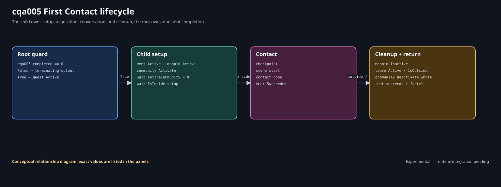
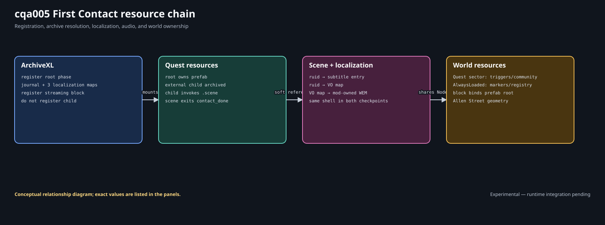
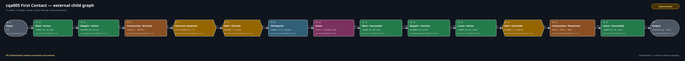

# Lab 5: First Contact

Lab 5 combines the systems from the first four labs into one small contact
encounter. A registered root calls an external child. The child activates a
one-entry community, waits for the actor and player to become ready, starts a
one-line scene through its named entry, consumes the named scene exit, and
delays cleanup until V has left the outer area.

| Record | Value |
| --- | --- |
| Procedure review date | 2026-08-09 |
| Structural validation date | 2026-08-09 |
| Runtime test date | Not yet recorded |

**Implementation status:** both supplied checkpoints contain eleven mod-owned
CR2W resources plus one WEM. The CR2W pairs are **Structurally validated** with
WolvenKit `8.19.0`; the WEM's container, format, duration, path, and hash are
checked separately. Mounting, actor materialization, scene playback, subtitle
and VO lookup, named return, stream-away/return, post-`contact_done` reload,
completed reload, pre-scene save loads, and cleanup are covered by the Lab 5
test procedure.

## What the lab demonstrates



```text
registered root -> cqa005_completed == 0?
  False -> terminate
  True  -> activate First Contact
        -> enter external child through In1
             activate meet objective and map pin
             Activate contact/default
             wait CharacterSpawned > 0 for the whole community
             wait until V is inside the broad setup area
             create checkpoint
             enter scene through start
             contact says one externally localized line
             scene exits through contact_done
             succeed meet; retire pin; activate leave
             wait until V is outside the cleanup area
             Deactivate the whole community
             succeed leave; return through Out1
        <- succeed quest; set cqa005_completed = 1; terminate
```

The two waits before the scene solve different races. `CharacterSpawned`
observes the community, while `IsInside #cqa005_tr_setup` controls player
placement. Neither is a substitute for the other. The outer cleanup wait keeps
the actor alive after the named scene exit and avoids removing the contact in
front of the player.

## Required environment

| Component | Exact version |
| --- | --- |
| Cyberpunk 2077 for Windows (GOG) | `2.31a` (public patch `2.31`) |
| WolvenKit | `8.19.0` |
| ArchiveXL | `1.27.0` |
| RED4ext | `1.30.0` |
| redscript | `0.5.31` |

Other versions may serialize different wrappers or produce different runtime
behavior.

## Prerequisites and downloads

Complete [Lab 4](../questphases/lab-04.md), then read:

- [Communities and characters](../communities/index.md);
- [Registries and compiled areas](../communities/registries-and-areas.md);
- [Entries, phases, and AI spots](../communities/entries-phases-and-ai-spots.md);
- [Scene resource anatomy](resource-anatomy.md);
- [Entry, exit, and quest handoff](entry-exit-and-quest-handoff.md);
- [One spoken line](one-spoken-line.md).

- [Download the start checkpoint](../downloads/cqa-lab-05-start.zip). It has
  the complete twelve-artifact scaffold, a three-node root, a two-node child,
  and a two-node `start -> contact_done` scene shell.
- [Download the completed checkpoint](../downloads/cqa-lab-05-completed.zip).
  It has the same ownership boundary with the seven-node root, fifteen-node
  child, and four-node scene described below.

Do not install both checkpoints. They register and pack the same depot paths.
For frozen runtime acceptance, establish the two documented untouched manual
originals, each of which has never loaded any CQA Lab 1–5 candidate. Case 1
then creates the exact pre-scene, post-contact, and completed manual seeds
under the unchanged canonical candidate; later cases use byte-identical
full-slot clones. Labs 3 and 4 share this site, and removing their files does
not erase their saved state. A console reset of `cqa005_completed` likewise
does not remove save-backed quest, journal, scene, community, actor, or
streamed-world state. See the test chapter for the five capture IDs and fan-out.

## Twelve runtime artifacts



| # | Artifact | Depot path | Owner or purpose |
| ---: | --- | --- | --- |
| 1 | Root questphase | `mod\cqa\cqa005\phases\cqa005.questphase` | Registration, one-shot guard, root prefab, child call, quest completion |
| 2 | Contact child questphase | `mod\cqa\cqa005\phases\cqa005_contact.questphase` | Meet, readiness, scene handoff, leave, and cleanup lifecycle |
| 3 | Scene | `mod\cqa\cqa005\scenes\cqa005_first_contact.scene` | Actors, screenplay item, line event, graph, entry, and named exit |
| 4 | Journal | `mod\cqa\cqa005\journal\cqa005.journal` | Quest, phase, two objectives, and contact map pin |
| 5 | Onscreen localization | `mod\cqa\cqa005\localization\en-us\onscreens\cqa005_onscreens.json` | Quest, objective, and map-pin text |
| 6 | Subtitle map | `mod\cqa\cqa005\localization\en-us\subtitles\cqa005_subtitles_map.json` | Registered route to the subtitle entries resource |
| 7 | Subtitle entries | `mod\cqa\cqa005\localization\en-us\subtitles\cqa005_subtitles.json` | Male and female text for locstring `9638591835734011695` |
| 8 | VO map | `mod\cqa\cqa005\localization\en-us\vo\cqa005_vo.json` | Male and female audio lookup for the same locstring |
| 9 | WEM | `mod\cqa\cqa005\localization\en-us\vo\contact_i_85c3283507e7ef2f.wem` | Prebuilt synthetic spoken audio |
| 10 | Streaming block | `mod\cqa\cqa005\world\cqa005_first_contact.streamingblock` | Quest and AlwaysLoaded sector descriptors |
| 11 | Quest sector | `mod\cqa\cqa005\world\cqa005_first_contact.streamingsector` | Setup/cleanup triggers, AI spot, and compiled community area |
| 12 | AlwaysLoaded sector | `mod\cqa\cqa005\world\cqa005_always_loaded.streamingsector` | Scene marker, map marker, and community registry |

The WEM is not a CR2W file and has no CR2W-JSON counterpart. Each checkpoint
therefore contains eleven raw/cooked CR2W pairs and one archived WEM. Its
source WAV and production record live outside the WolvenKit `source` tree so
they cannot be packed accidentally.

## Registration versus indirect dependencies

ArchiveXL registers six roots:

```yaml
quest:
  phases:
  - path: mod\cqa\cqa005\phases\cqa005.questphase
    parent: base\quest\cyberpunk2077.quest

journal:
- mod\cqa\cqa005\journal\cqa005.journal

localization:
  onscreens:
    en-us:
    - mod\cqa\cqa005\localization\en-us\onscreens\cqa005_onscreens.json
  subtitles:
    en-us:
    - mod\cqa\cqa005\localization\en-us\subtitles\cqa005_subtitles_map.json
  vomaps:
    en-us:
    - mod\cqa\cqa005\localization\en-us\vo\cqa005_vo.json

streaming:
  blocks:
  - mod\cqa\cqa005\world\cqa005_first_contact.streamingblock
```

The child phase, scene, subtitle entries, WEM, and two sectors are archived
dependencies. They are reached respectively by `phaseResource`, `sceneFile`,
the subtitle map, the VO map, and the streaming-block descriptors. Registering
those indirect resources as additional roots changes the ownership model and
is rejected by the supplied validator.

## Root and child ownership

The registered root declares one prefab:

```text
#cqa005_pr_first_contact
```

The child has `phasePrefabs: []`, and the external phase node has
`phaseInstancePrefabs: []`. The root's world-side expansion is:

```text
$/mod/cqa/cqa005/#cqa005_pr_first_contact
  #cqa005_tr_setup
  #cqa005_tr_cleanup
  #cqa005_spot_contact
  #cqa005_com_contact
  #cqa005_sm_contact
  #cqa005_mp_contact
```

The two marker nodes and registry live in the AlwaysLoaded sector. The two
triggers, AI spot, and compiled area live in the finite Quest sector. Root
ownership does not make every nested node AlwaysLoaded; the block descriptors
still decide sector lifetime.

## Exact root graph


| ID | RED node type | Decisive payload |
| ---: | --- | --- |
| `0` | `questInputNodeDefinition` | Root `In1` interface |
| `1` | `questOutputNodeDefinition` | Terminating `Out1` |
| `10` | `questConditionNodeDefinition` | `cqa005_completed Equal 0` |
| `11` | `questJournalNodeDefinition` | Set First Contact quest `Active` |
| `12` | `questPhaseNodeDefinition` | Soft `cqa005_contact.questphase`; null inline graph; empty instance prefabs |
| `13` | `questJournalNodeDefinition` | Set First Contact quest `Succeeded` |
| `14` | `questFactsDBManagerNodeDefinition` | Set `cqa005_completed = 1` exactly |

Its seven edges are:

```text
0.Out -> 10.In
10.False -> 1.In
10.True -> 11.Active
11.Out -> 12.In1
12.Out1 -> 13.Succeeded
13.Out -> 14.In
14.Out -> 1.In
```

The completion fact is deliberately written only after the child returns and
the quest reaches succeeded state. This is the candidate's exact policy, not a
universal ordering rule.

## Exact contact child



| ID | RED node type | Purpose |
| ---: | --- | --- |
| `0` | `questInputNodeDefinition` | Receive `In1` |
| `1` | `questOutputNodeDefinition` | Return terminating `Out1` |
| `10` | `questJournalNodeDefinition` | Activate meet objective |
| `11` | `questMappinManagerNodeDefinition` | Activate contact pin |
| `12` | `questSpawnManagerNodeDefinition` | `Activate contact/default` |
| `13` | `questPauseConditionNodeDefinition` | Wait `CharacterSpawned Greater 0`, `entireCommunity: 1` |
| `14` | `questPauseConditionNodeDefinition` | Wait player `IsInside #cqa005_tr_setup` |
| `15` | `questCheckpointNodeDefinition` | Create the pre-scene checkpoint |
| `16` | `questSceneNodeDefinition` | Enter `start`; continue only from `contact_done` |
| `17` | `questJournalNodeDefinition` | Succeed meet objective |
| `18` | `questMappinManagerNodeDefinition` | Inactivate contact pin |
| `19` | `questJournalNodeDefinition` | Activate leave objective |
| `20` | `questPauseConditionNodeDefinition` | Wait player `IsOutside #cqa005_tr_cleanup` |
| `21` | `questSpawnManagerNodeDefinition` | `Deactivate` with entry/phase `None` for the whole community |
| `22` | `questJournalNodeDefinition` | Succeed leave objective |

The fourteen edges form one ordered chain from `0.Out` to `1.In`. Node `16`
has exactly five sockets: `CutDestination`, input `start`, output
`contact_done`, and the unconnected `Default INT` and `Default RET` outputs.
There is no invented `end` output. The child continues only from the exit name
actually published by the scene.

## Community and world identity contract


The canonical contact is a generic Tyger Claws record, not a unique
story-managed actor:

```text
characterRecordId:
  Character.jpn_tyger_claws_biker2_ranged2_copperhead_wa
appearance: default
entry: contact
phase: default
workspot:
  base\workspots\common\ground\
  generic__stand_ground_cigarette__smoke__01.workspot
```

The registry sets `entryActiveOnStart: 0`, one quantity, and a non-sequence
time period. Quest logic activates it explicitly.

Three 64-bit identity domains stay distinct:

1. the compiled area's `sourceObjectId` equals the registry item's
   `communityId`;
2. the registry node placement has a different numeric world identity;
3. the AI spot's global ID is repeated by the compiled area's `spotNodeIds`
   and registry `workspotsPersistentData`.

All three are derived from full NodeRef-aware source strings. They are not
plain FNV hashes of debug labels, and the `#` alias marker has RED4-specific
hash behavior. The registry's numeric placement identity is also not an
ordinary string entry in the sector's `nodeRefs` array.

The exact character/workspot pair occurs in a
[retained community candidate](../reference/evidence-version-matrix.md#retained-legacy-runtime-evidence).
That result proves the pair was present in the successful candidate; it does
not separately prove the quality of its cigarette animation in every context.
The Lab 5 test guide checks spawn, passivity, acquisition, and cleanup.
Cigarette and workspot animation quality are visual checks you should repeat
for any actor or appearance you substitute.

## Exact scene contract


The completed scene graph has four nodes and three edges:

```text
[1] Start -- output 0/0 --> [2] Section input 0/0
          \-- same output --> [4] PuppetAI input 0/1
[2] Section -- output 0/0 --> [3] End (Terminating)
[4] PuppetAI -- output 0/0 --> no destination
```

The PuppetAI branch places the contact in the `Cinematic` AI tier and is
fire-and-forget. It does not delay the named exit. Section output stamp `1/0`
is the deliberately unconnected cancel route. `startNodes` contains node `1`,
`endNodes` contains node `3`, entry `start` targets node `1`, and exit
`contact_done` targets node `3`.

Actor `0`, `contact`, uses community acquisition for entry `contact`. Player
actor `1`, `V`, uses `findInContext` with
`Character.Player_Puppet_Base`. Their performer IDs are `1` and `257`; both
select lipsync slot `0`. The scene retains one vanilla lipsync animation-set
reference by depot path without redistributing that resource.

The screenplay store contains one `scnscreenplayDialogLine` spoken by actor
`0` to actor `1`, with gender mask `3`. One `scnDialogLineEvent` points to that
item. The line is:

> All clear. Keep moving.

Its unsigned locstring ID is `9638591835734011695`. The section lasts the
audio duration plus 400 ms. The embedded `locStore` remains typed and empty:
spoken text and sound come from external localization resources.

The start checkpoint retains the same actors, lipsync reference, entry, exit,
debug scaffold, and typed empty stores, but its graph is only Start `1` to
terminating End `3`. Neither start phase graph invokes that scene shell.

## Spoken-line lookup

```text
scene line locstring 9638591835734011695
  -> registered subtitle map
       -> archived subtitle entries
            femaleVariant = maleVariant = "All clear. Keep moving."
  -> registered VO map
       -> archived WEM for femaleResPath and maleResPath
```

The WEM is a new synthetic line, not extracted game audio and not copied from
a research project. Its exact production provenance, source WAV, path, and
SHA-256 are supplied with the checkpoint. The prebuilt WEM is hash-pinned
because Wwise conversion is not claimed to be byte-reproducible. General WEM
production belongs to the later audio chapter; this lab teaches the native
lookup and ships one inspectable input/output pair.

## Geometry and delayed cleanup


The example reuses the checked Allen Street center from Labs 3 and 4:

| Owner | Center | Geometry |
| --- | --- | --- |
| Setup trigger | `(-1000.02, 1497.2208, 2.3)` | 25 m circumradius, 16 points, 12 m high |
| Cleanup trigger | `(-1000.02, 1497.2208, 0.3)` | 110 m circumradius, 20 points, 16 m high |
| Contact AI spot | `(-1000.02, 1497.2208, 6.957)` | cigarette workspot, yaw `88.6` degrees |
| Scene and map markers | `(-1000.02, 1497.2208, 8.3)` | yaw `88.6` degrees |

The broad setup area makes a fast arrival less likely to outrun actor
readiness. The much larger cleanup area keeps the contact present while V can
still see the meeting point. These dimensions are a candidate design choice,
not a universal safe radius.

## Common failure modes

| Symptom | Check first |
| --- | --- |
| Quest never appears | Root registration, archive pair, ArchiveXL and RED4ext logs, clean-save provenance |
| Objective appears but contact does not | Quest-sector streaming, community/source join, entry and phase names, spot ID joins, `CharacterSpawned` payload |
| Contact spawns hostile | Generic character record, AI state, absence of unrelated combat stimuli, exact candidate hash |
| Contact exists but scene does not start | Setup trigger, scene marker, actor acquisition reference, named `start` socket |
| Mouth moves but there is no subtitle or sound | Locstring equality across scene, subtitle entries, and VO map; registered map paths; archived WEM path |
| Line plays but quest stalls | Scene exit `contact_done`, End `3`, quest scene-node output name, unconnected default outputs |
| Contact disappears in view | Cleanup `IsOutside` radius and deactivation order |
| Completed save starts again | `cqa005_completed`, write order, exact installed candidate, and original save provenance |

Lab sequence: [All labs](../reference/labs-at-a-glance.md) · Next: [Author
First Contact in WolvenKit](lab-05-authoring.md).
