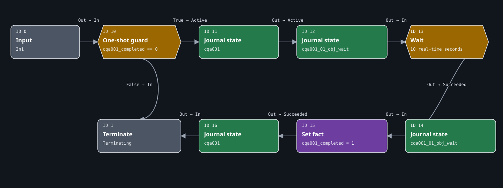

# Lab 1: First Signal

Lab 1 establishes the smallest useful native quest loop: register a root
questphase, show one objective, wait ten real-time seconds, complete the
objective and quest, persist a one-shot guard, and terminate.

| Record | Value |
| --- | --- |
| Procedure review date | 2026-08-09 |
| Structural validation date | 2026-07-27 |
| Runtime test date | Not yet recorded |

**Lab 1 runtime evidence:** **Experimental** — pending.

**Implementation status:** the supplied resources are **Structurally
validated** after WolvenKit 8.19.0 deserialization and round-trip inspection.
The dedicated marker above is synchronized with the eight-case, hash-bound
runtime-acceptance record.

The complete [manual WolvenKit authoring, installation, test, and reset
walkthrough](lab-01-authoring.md) builds this design from the empty checkpoint.
This page remains the concise resource and graph reference.

## Outcome

On a clean save, the intended player-facing sequence is:

```text
root quest starts
  -> already completed?
     +-> yes: terminate
     +-> no: show First Signal and Wait for the signal.
          -> wait 10 real-time seconds
          -> complete objective
          -> persist cqa001_completed = 1
          -> complete quest
          -> terminate
```

There is no trigger, marker, scene, character, device, combat encounter, or
custom world resource. Those systems enter in later labs.

## Prerequisites and tested baseline

Read [Foundations](../foundations/index.md) first. The lab assumes you can
distinguish resource ownership, socket semantics, identifier domains, and
save-backed state.

Use the exact [first-release version set](../reference/tested-versions.md):
Cyberpunk 2077 `2.31a`, WolvenKit `8.19.0`, ArchiveXL `1.27.0`, RED4ext
`1.30.0`, and the pinned redscript `0.5.31` (ArchiveXL requires `0.5.31` or
newer).

The example has two checkpoints:

- [Download the start checkpoint](../downloads/cqa-lab-01-start.zip), an empty
  WolvenKit project;
- [Download the completed checkpoint](../downloads/cqa-lab-01-completed.zip),
  containing the mod-owned resource set and serialized review artifacts.

The source directories remain available on
[GitHub](https://github.com/hlky/cyberpunk-quest-authoring/tree/main/examples/lab-01-one-shot).

Use a dedicated test save. The completion fact is stored in the save and is
deliberately not reset by the quest.

Follow the [manual authoring walkthrough](lab-01-authoring.md) to create the
resources, enter the property paths, wire every socket, install the project,
and run the Experimental clean-save acceptance matrix.

## Resource model

Three native resources and one framework file divide responsibility:

| Resource | Depot path | Owns |
| --- | --- | --- |
| Root questphase | `mod\cqa\cqa001\phases\cqa001.questphase` | Execution order, one-shot guard, delay, journal state changes, completion fact, and termination |
| Journal | `mod\cqa\cqa001\journal\cqa001.journal` | Quest, phase, and objective entries |
| Onscreen localization | `mod\cqa\cqa001\localization\en-us\onscreens\cqa001.json` | Player-facing English strings referenced by journal entries |
| ArchiveXL registration | `CQA_Lab01_OneShot.archive.xl` | Attaches the root questphase and merges the journal and localization resources |

The questphase does not contain the text “First Signal.” It changes journal
entry state. The journal contains localization keys, and the onscreen
localization resource resolves those keys to text.

## Journal tree

The journal resource supplies this exact tree:

```text
quests
└── minor_quest
    └── cqa001                         gameJournalQuest
        └── cqa001_01                  gameJournalQuestPhase
            └── cqa001_01_obj_wait     gameJournalQuestObjective
```

Localization keys:

| Key | English text |
| --- | --- |
| `cqa_cqa001_title` | `First Signal` |
| `cqa_cqa001_objective_wait` | `Wait for the signal.` |

Questphase journal paths use `fileEntryIndex: 2`, the zero-based path component
for the containing `cqa001` file entry in `quests/minor_quest/cqa001/...`.
This value is not the leaf index and is not a CR2W handle.

## Exact questphase



The figure is generated from the supplied WolvenKit CR2W-JSON. Its layout file
contains no duplicate nodes or edges and records source fingerprint
`sha256:4f19c675ab57194ce73a007aca29c3c973e9c98f1129fc4cf05e756bfaeafa82`.

| ID | RED node type | Incoming socket | Decisive property | Purpose |
| ---: | --- | --- | --- | --- |
| `0` | `questInputNodeDefinition` | root `In1` | socket name `In1` | Entry from the registered root |
| `10` | `questConditionNodeDefinition` | `In` | `cqa001_completed Equal 0` | Evaluate once and choose `True` or `False` immediately |
| `11` | `questJournalNodeDefinition` | `Active` | path `quests/minor_quest/cqa001` | Activate and track the quest |
| `12` | `questJournalNodeDefinition` | `Active` | objective path | Activate and track the objective |
| `13` | `questPauseConditionNodeDefinition` | `In` | `questRealtimeDelay_ConditionType`, 10 seconds | Hold this execution path until elapsed real time reaches ten seconds |
| `14` | `questJournalNodeDefinition` | `Succeeded` | objective path | Mark the objective succeeded |
| `15` | `questFactsDBManagerNodeDefinition` | `In` | set `cqa001_completed` exactly to `1` | Persist one-shot completion state |
| `16` | `questJournalNodeDefinition` | `Succeeded` | path `quests/minor_quest/cqa001` | Mark the quest succeeded |
| `1` | `questOutputNodeDefinition` | `In` | `Terminating` | End either the already-completed or first-run route |

`Condition` and `PauseCondition` are not interchangeable. ID `10` snapshots a
fact and immediately chooses one output. ID `13` keeps waiting until its time
condition becomes true.

The completion fact is set after the objective succeeds but before the quest
succeeds. If testing later exposes a save interruption between those nodes,
the ordering must be revisited and recorded rather than silently called safe.

## Registration

ArchiveXL registers the root and resource merges:

```yaml
quest:
  phases:
  - path: mod\cqa\cqa001\phases\cqa001.questphase
    parent: base\quest\cyberpunk2077.quest

journal:
- mod\cqa\cqa001\journal\cqa001.journal

localization:
  onscreens:
    en-us:
    - mod\cqa\cqa001\localization\en-us\onscreens\cqa001.json
```

The `parent` path is a vanilla depot reference. The example cites it; it does
not redistribute the base-game resource.

See [Registering a root questphase](../questphases/root-registration.md) for
the difference between root reachability, location gates, resource merges, and
runtime proof.

## Verification plan

Structural checks already completed:

1. deserialize all three CR2W-JSON sources with WolvenKit 8.19.0;
2. serialize the resulting binaries back to JSON;
3. compare quest node IDs, types, sockets, edges, and decisive properties;
4. compare the journal entry tree and localization keys;
5. verify the exact SVG against its source fingerprint.

Runtime acceptance still required:

1. start from a save that has never loaded `cqa001`;
2. confirm the quest and objective activate once;
3. confirm completion occurs after ten seconds of real time;
4. confirm the objective and quest both show succeeded presentation;
5. save, reload, and confirm the quest does not reactivate;
6. inspect ArchiveXL and game logs for registration or lookup errors.

Until those checks pass, expected behavior is not runtime proof.

## Common failure boundaries

- If nothing starts, inspect ArchiveXL root-phase registration and the depot
  path before changing graph logic.
- If text is blank, compare journal localization keys with onscreen secondary
  keys. Journal IDs are not localization IDs.
- If the objective remains active, verify that the edge enters ID `14` through
  `Succeeded`, not `Active`.
- If the quest repeats, check `cqa001_completed` on the exact save used for the
  second run.
- If a test appears fixed after editing a device, journal, scene, or fact,
  repeat it on a clean save before attributing the change to the resource edit.
