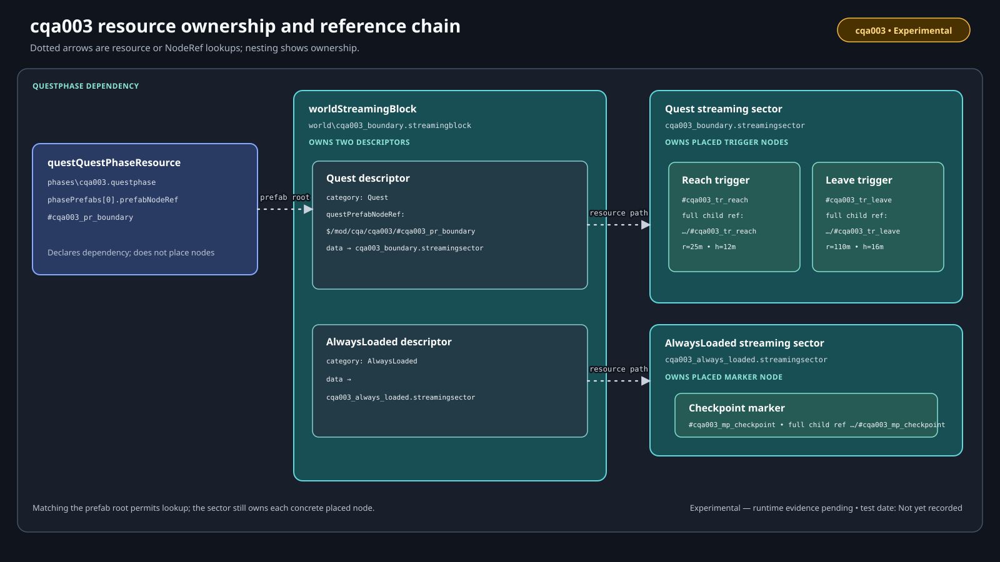
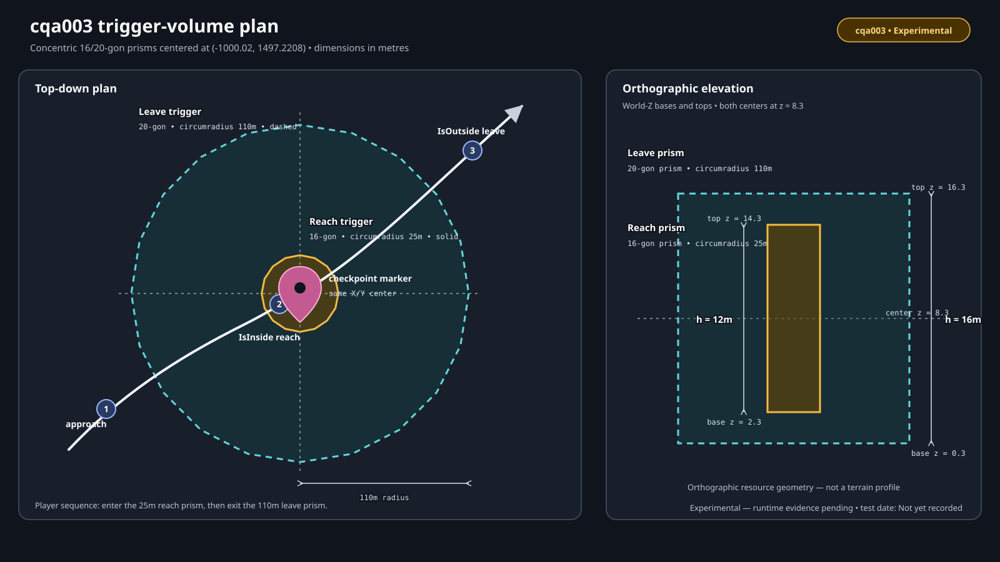
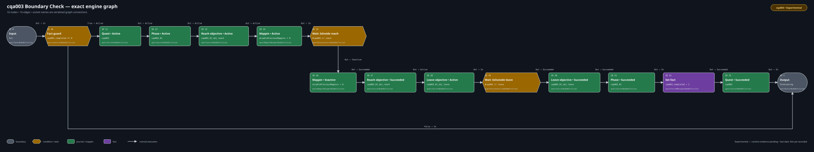

# Lab 3: Boundary Check

Lab 3 connects a registered questphase to mod-owned world streaming. The
player follows a journal map pin to a checkpoint, enters a smaller trigger,
then leaves a wider trigger to complete the quest.

| Record | Value |
| --- | --- |
| Procedure review date | 2026-08-09 |
| Structural validation date | 2026-08-09 |
| Runtime test date | Not yet recorded |

**Implementation status:** both supplied checkpoints are **Structurally
validated** after all twelve checkpoint CR2W resources were cooked and
serialized back with WolvenKit 8.19.0. Their native types, graph, NodeRef
chain, sector placement records, outline buffers, journal paths, and block
descriptors are exact. The test chapter checks mounting, streaming, marker/GPS
presentation, trigger behavior, and save/reload behavior in game.

Follow [Author Boundary Check in WolvenKit](lab-03-authoring.md) to expand the
start checkpoint. Then use [Test Boundary Check](lab-03-test.md) to bind the
candidate, saves, visible observations, and logs.

## What the lab demonstrates

The quest uses state-shaped trigger predicates so reloads on either side of a
boundary are testable:

```text
entry -> completed == 0?
  True  -> activate quest, phase, reach objective, and pin
        -> wait until player IsInside the 25 m reach volume
        -> retire pin, succeed reach, activate leave objective
        -> wait until player IsOutside the 110 m leave volume
        -> succeed leave and phase -> completed = 1 -> succeed quest -> end
  False -> end
```

`IsInside` and `IsOutside` are not synonyms for `Entered` and `Exited`.
The former describe current state; the latter describe a transition event.
Vanilla resources contain all three shapes, but the behavior of this new
combination still needs its own runtime evidence.

## Prerequisites and downloads

Complete [Lab 1](../start-here/lab-01.md) and read:

- [Streaming model](streaming-model.md);
- [Quest prefabs and NodeRefs](quest-prefabs-and-noderefs.md);
- [Sector nodes and placement](sector-nodes-and-placement.md);
- [Triggers and areas](triggers-and-areas.md);
- [Markers and navigation](markers-and-navigation.md).

Use Cyberpunk 2077 `2.31a` for Windows (GOG), WolvenKit `8.19.0`, ArchiveXL
`1.27.0`, RED4ext `1.30.0`, and redscript `0.5.31`.

- [Download the start checkpoint](../downloads/cqa-lab-03-start.zip). It has
  the entire mod-owned world scaffold and a two-node terminating phase.
- [Download the completed checkpoint](../downloads/cqa-lab-03-completed.zip).
  It has the same scaffold and the exact 16-node quest graph.

Do not install the two checkpoints together. They register the same six depot
paths. Use an untouched save created before either was first installed.

## Resource ownership



| Resource | Depot path | Owns |
| --- | --- | --- |
| Root questphase | `mod\cqa\cqa003\phases\cqa003.questphase` | Phase graph and root prefab declaration |
| Journal | `mod\cqa\cqa003\journal\cqa003.journal` | Quest, phase, two objectives, and the reach-objective map pin |
| Onscreen localization | `mod\cqa\cqa003\localization\en-us\onscreens\cqa003.json` | Title, two objectives, and pin caption |
| Streaming block | `mod\cqa\cqa003\world\cqa003_boundary.streamingblock` | Quest and AlwaysLoaded sector descriptors |
| Quest sector | `mod\cqa\cqa003\world\cqa003_boundary.streamingsector` | Reach and leave trigger node definitions and placements |
| AlwaysLoaded sector | `mod\cqa\cqa003\world\cqa003_always_loaded.streamingsector` | Static marker definition and placement |
| ArchiveXL registration | `CQA_Lab03_BoundaryCheck.archive.xl` | Root attachment, journal/localization merge, and streaming block registration |

ArchiveXL registers the block, not its two sectors separately. Descriptor
`data` paths make the sectors reachable from the block.

The root questphase declares one local prefab root:

```text
#cqa003_pr_boundary
```

The world records use its mod-owned full form:

```text
$/mod/cqa/cqa003/#cqa003_pr_boundary
```

Nested references are:

```text
#cqa003_tr_reach
#cqa003_tr_leave
#cqa003_mp_checkpoint
```

The quest graph uses the local trigger refs because its root declares the
prefab. Sector `nodeRefs` and `QuestPrefabRefHash` records use the full child
refs. This single-root design avoids making a claim about dependency
inheritance across external child phases.

## World layout



| Owner | Category / level | Node | Placement | Geometry or orientation |
| --- | --- | --- | --- | --- |
| Quest sector | `Quest` / `255` | `worldTriggerAreaNode` reach | `(-1000.02, 1497.2208, 2.3)` | 16-point, 25 m radius, 12 m high |
| Quest sector | `Quest` / `255` | `worldTriggerAreaNode` leave | `(-1000.02, 1497.2208, 0.3)` | 20-point, 110 m radius, 16 m high |
| AlwaysLoaded sector | `AlwaysLoaded` / `1` | `worldStaticMarkerNode` | `(-1000.02, 1497.2208, 8.3)` | yaw `88.6°` |

These are inherited test-site values, not a promise that the location is
reachable or the volumes are appropriate on every game build. The acceptance
matrix—not structural inspection—governs runtime claims about the marker, both
outlines, their vertical coverage, and the finite padded Quest descriptor
bounds.

The site is the outdoor recycling-station cabinet row in Watson/Kabuki. A
focused vanilla sector, TweakDB, and localization chain identifies the Allen
Street terminal and linked marker about 90 m southwest of the lab center;
[Test Boundary Check](lab-03-test.md) explains how to verify that ordinary
route before installing the candidate. Those identities and coordinates are
**Observed in vanilla**. The retained matrix governs runtime claims about
practical access, the route, and the new 110 m boundary.

Each Quest placement's `NodeIndex` selects the corresponding local entry in
`nodes`; the marker placement selects the only marker node. This is true for
the compact mod-owned sectors. It is not a universal parallel-array rule for
all vanilla sectors.

## Authoritative trigger geometry

Each trigger owns a `questTriggerNotifier_Quest` and an
`AreaShapeOutline`. The outline's encoded `buffer` contains point count,
four-float points, and height. Repository validation decodes that buffer and
requires it to match the intended 16/20 points and 12/16 heights.

Do not change only the visible `points` or `height`. Retained vanilla exports
show that the displayed JSON points can be defaults while the buffer carries
different authoritative geometry. If the outline changes, regenerate or
reserialize all three representations through a tool path that updates the
buffer, then inspect the cooked result.

`MaxStreamingDistance` is named and compared. `UkFloat1` is retained as an
opaque field; this book does not rename it to a streaming distance without
evidence.

## Journal and marker contract

```text
quests
└── minor_quest
    └── cqa003
        └── cqa003_01
            ├── cqa003_01_obj_reach
            │   └── cqa003_01_qmp_checkpoint
            └── cqa003_01_obj_leave
```

| Journal entry | Localization key | English text |
| --- | --- | --- |
| Quest title | `cqa_cqa003_title` | `Boundary Check` |
| Reach objective | `cqa_cqa003_objective_reach` | `Reach the marked checkpoint.` |
| Leave objective | `cqa_cqa003_objective_leave` | `Leave the checkpoint area.` |
| Map-pin caption | `cqa_cqa003_mappin_checkpoint` | `Boundary Check checkpoint` |

The journal map pin references `#cqa003_mp_checkpoint` and enables GPS. The
static marker places an anchor; the journal entry owns player-facing mappin
data; quest Mappin Manager nodes activate and deactivate that journal state.
None of those records substitutes for the other two.

Both Lab 3 Mappin Manager nodes set `disablePreviousMappins: 0`. This isolated
lab has no deliberate previous route to replace; activation and inactivation
come from the nodes' `Active` and `Inactive` sockets.

## Exact questphase



The figure is generated from the completed checkpoint. Validation resolves
socket handles and requires exactly 16 nodes and 16 edges.

| ID | RED node type | Decisive payload | Purpose |
| ---: | --- | --- | --- |
| `0` | `questInputNodeDefinition` | interface `In1` | Enter registered root |
| `1` | `questOutputNodeDefinition` | terminating `Out1` | End success and bypass routes |
| `10` | `questConditionNodeDefinition` | `cqa003_completed Equal 0` | Bypass a completed save |
| `11` | `questJournalNodeDefinition` | quest path | Activate Boundary Check |
| `12` | `questJournalNodeDefinition` | phase path | Activate phase |
| `13` | `questJournalNodeDefinition` | reach objective | Activate reach objective |
| `14` | `questMappinManagerNodeDefinition` | map-pin path, disable previous `0` | Activate/track checkpoint pin |
| `15` | `questPauseConditionNodeDefinition` | player `IsInside #cqa003_tr_reach` | Wait for current inside state |
| `16` | `questMappinManagerNodeDefinition` | same map-pin path | Inactivate checkpoint pin |
| `17` | `questJournalNodeDefinition` | reach objective | Succeed reach objective |
| `18` | `questJournalNodeDefinition` | leave objective | Activate leave objective |
| `19` | `questPauseConditionNodeDefinition` | player `IsOutside #cqa003_tr_leave` | Wait for current outside state |
| `20` | `questJournalNodeDefinition` | leave objective | Succeed leave objective |
| `21` | `questJournalNodeDefinition` | phase path | Succeed phase |
| `22` | `questFactsDBManagerNodeDefinition` | set `cqa003_completed = 1` exactly | Persist one-shot completion |
| `23` | `questJournalNodeDefinition` | quest path | Succeed Boundary Check |

Every node has one explained responsibility. The graph does not contain a
hidden hub, child phase, scene, community, device, or script dependency.

## Exact edge contract

| Source | Destination | Meaning |
| --- | --- | --- |
| `0.Out` | `10.In` | Enter guard |
| `10.False` | `1.In` | Completed-save bypass |
| `10.True` | `11.Active` | First-run activation |
| `11.Out` | `12.Active` | Activate phase |
| `12.Out` | `13.Active` | Activate reach objective |
| `13.Out` | `14.Active` | Activate pin |
| `14.Out` | `15.In` | Arm reach condition |
| `15.Out` | `16.Inactive` | Retire pin after reach |
| `16.Out` | `17.Succeeded` | Succeed reach objective |
| `17.Out` | `18.Active` | Activate leave objective |
| `18.Out` | `19.In` | Arm leave condition |
| `19.Out` | `20.Succeeded` | Succeed leave objective |
| `20.Out` | `21.Succeeded` | Succeed phase |
| `21.Out` | `22.In` | Write completion fact |
| `22.Out` | `23.Succeeded` | Succeed quest |
| `23.Out` | `1.In` | Terminate successful route |

The only persistent fact is `cqa003_completed`. Quest, journal, active-node,
world, and marker state can also be save-backed even though they are not
FactsDB names.

## Common failure modes

| Symptom | Check first | Boundary |
| --- | --- | --- |
| Quest never appears | Installed archive plus loose `.archive.xl`, root phase/journal/localization paths, ArchiveXL and RED4ext logs | Structural validation does not establish runtime activation |
| Objective appears but pin does not | Journal map-pin path, marker NodeRef, AlwaysLoaded descriptor, and Mappin Manager state socket | Do not infer GPS or sector behavior from the objective alone |
| Pin appears at the wrong height | Marker placement Z, yaw, terrain accessibility, and clean-save provenance | Judge inherited coordinates from the exact candidate's retained runtime evidence |
| Entering does nothing | Quest-sector descriptor root, full child ref, local condition ref, player activator flag, trigger notifier, and decoded reach buffer | JSON `points` alone are not geometry evidence |
| Leave completes immediately | Confirm the starting save is inside the outer volume when leave activates and the condition is `IsOutside` | A dirty save or bad vertical coverage changes the initial state |
| Area works until streaming away | Finite Quest bounds, sector logs, return route, and NodeRef resolution | One successful nearby crossing does not prove unload/reload behavior |
| Quest reactivates after reload | `completed` write order, guard comparison, exact candidate hash, and untouched/completed save identity | Console resets are diagnostic, not clean acceptance |

Lab sequence: [All labs](../reference/labs-at-a-glance.md) · Next: [Author
Boundary Check in WolvenKit](lab-03-authoring.md).
